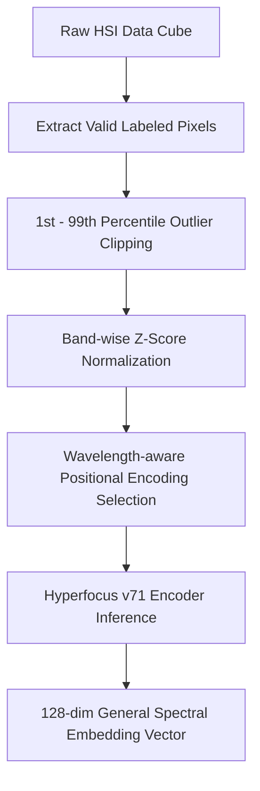
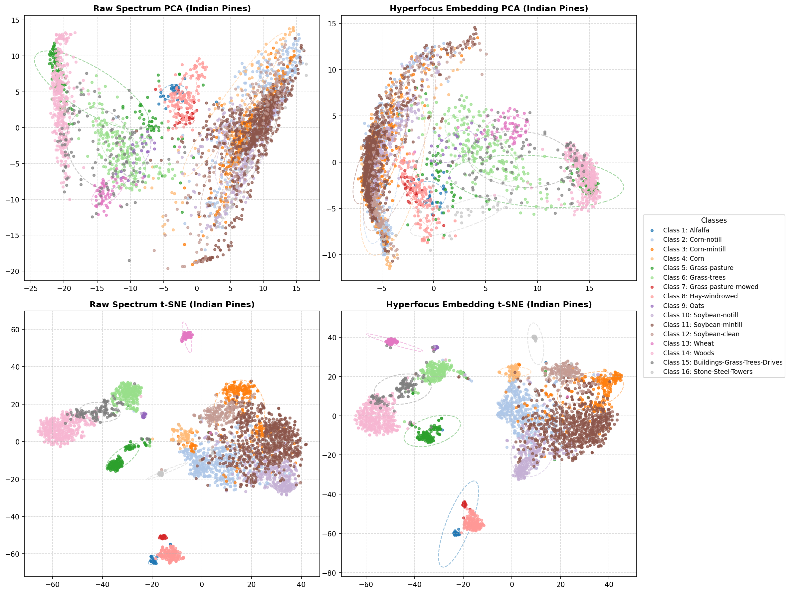
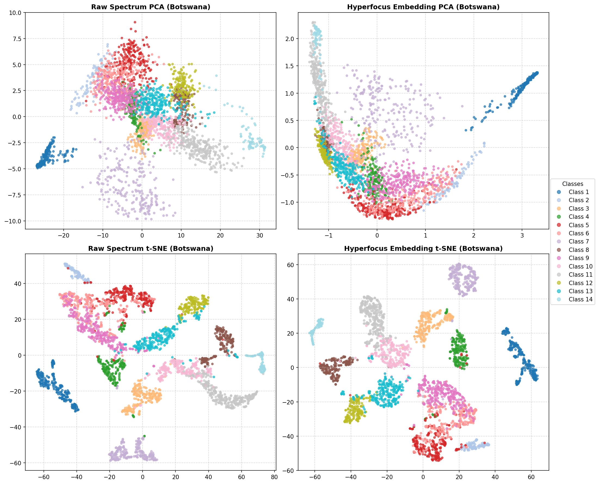
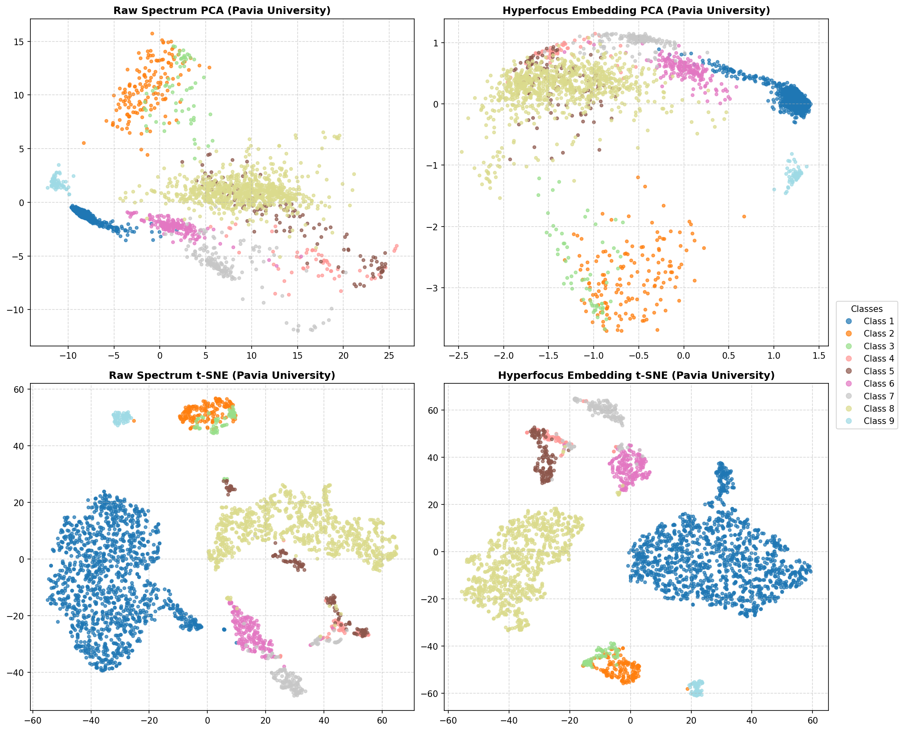
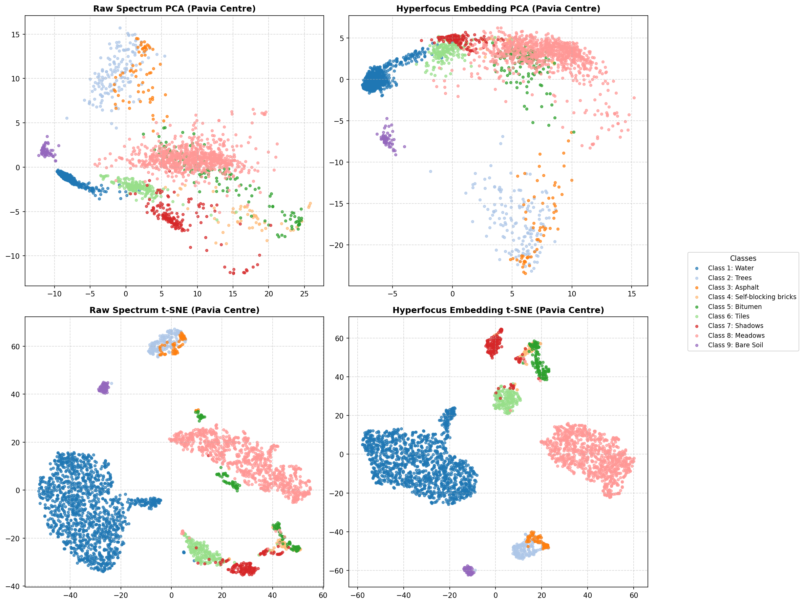
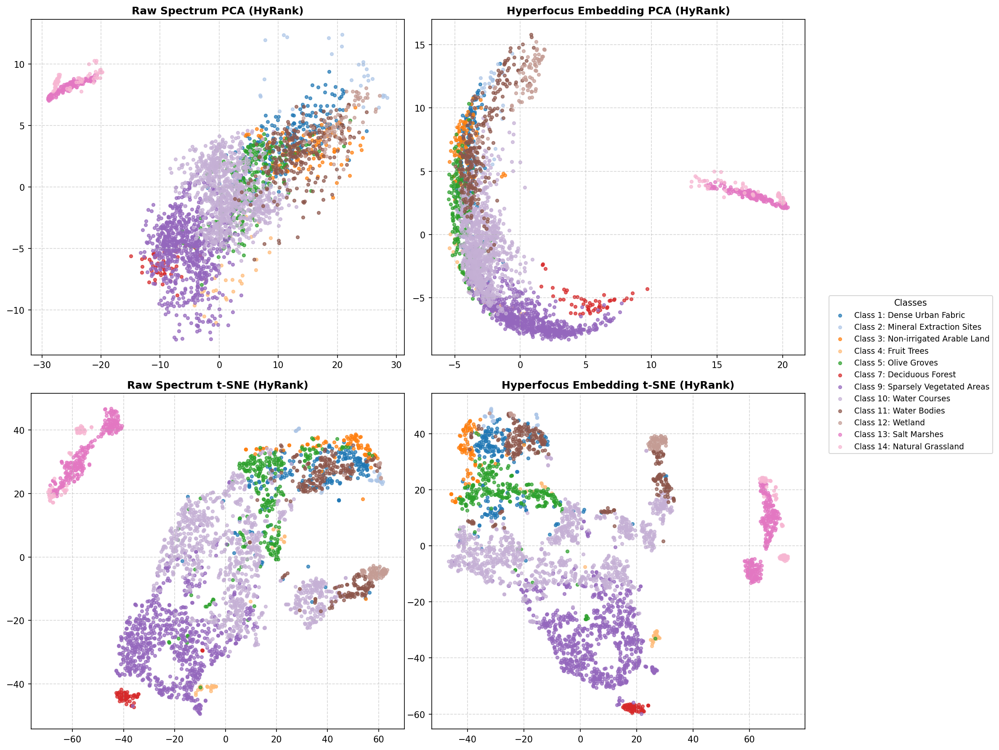

# Hyperfocus HSI Embedding Analysis & Evaluation (v71)

본 저장소는 초분광 영상(Hyperspectral Image, HSI) 분석에 최적화된 도메인 독립적 스펙트럼 재구성 기반의 **Hyperfocus (v71) Foundation Model**을 활용하여, 5대 글로벌 초분광 벤치마크 데이터셋의 스펙트럼 임베딩 특성 및 분류 성능을 다각도로 평가하고 분석한 결과물입니다.

---

## 📌 목차 (Table of Contents)

1. [서론 (Introduction)](#1-서론-introduction)
2. [평가 대상 데이터셋 개요](#2-평가-대상-데이터셋-개요)
3. [분광분석 전처리 및 임베딩 추출 워크플로우](#3-분광분석-전처리-및-임베딩-추출-워크플로우)
4. [데이터셋별 상세 시각화 및 분광 특성 분석](#4-데이터셋별-상세-시각화-및-분광-특성-분석)
   - [4.1 Indian Pines](#41-indian-pines)
   - [4.2 Botswana](#42-botswana)
   - [4.3 Pavia University](#43-pavia-university)
   - [4.4 Pavia Centre](#44-pavia-centre)
   - [4.5 HyRank (Dioni)](#45-hyrank-dioni)
5. [정량적 분류 및 군집화 성능 평가 (Summary Metrics)](#5-정량적-분류-및-군집화-성능-평가-summary-metrics)
6. [결론 및 분광분석 전문가적 고찰](#6-결론-및-분광분석-전문가적-고찰)
7. [설치 및 실행 방법](#7-설치-및-실행-방법)
8. [교차 데이터셋 스펙트럼 임베딩 간섭 분석 (New Report)](#8-교차-데이터셋-스펙트럼-임베딩-간섭-분석-new-report)
9. [교차 데이터셋 시맨틱 정렬 및 도메인 일반화 (New Report)](#9-교차-데이터셋-시맨틱-정렬-및-도메인-일반화-new-report)

---

## 1. 서론 (Introduction)

초분광 영상(Hyperspectral Image, HSI)은 연속적이고 조밀한 파장 대역 정보를 제공하여 지표물의 물리적·화학적 특성을 매우 정밀하게 감지할 수 있게 합니다. 그러나 높은 차원으로 인한 '차원의 저주(Curse of Dimensionality)'와 노이즈, 대기 산란 등으로 인해 고성능 분류기 설계에 어려움이 따릅니다.

**Hyperfocus (v71)** 모델은 Masked Autoencoder(MAE) 학습 기법을 채택하여, 센서 에그노스틱(Sensor-Agnostic)하면서도 풍부한 스펙트럼 표현(General Spectral Representation)을 사전 학습한 기초 모델(Foundation Model)입니다. 본 분석에서는 Hyperfocus 모델이 생성한 128차원의 스펙트럼 임베딩 벡터가 기존의 Raw 분광 반사율 대비 얼마나 유의미하게 지표 클래스별 분별력(Discriminability)을 향상시키고 노이즈를 제어하는지 분석합니다.

---

## 2. 평가 대상 데이터셋 개요

본 분석에서 사용한 5대 글로벌 초분광 벤치마크 데이터셋의 상세 스펙은 다음과 같습니다:

| 데이터셋 | 센서 종류 | 밴드 수 | 유효 픽셀 수 | 주요 관측 테마 / 특징 |
| :--- | :---: | :---: | :---: | :--- |
| **Indian Pines** | 항공 AVIRIS | 220 / 200 | 10,249 | 복잡한 농경지 작물류의 복잡한 간섭 극복 |
| **Botswana** | 위성 Hyperion | 145 | 3,248 | 사바나 습지대 및 수생/육생 식생 분류 |
| **Pavia University** | 항공 ROSIS | 103 | 148,152 | 단파적외선(SWIR) 결여 극복 및 고해상도 도심 격리 |
| **Pavia Centre** | 항공 ROSIS | 102 | 148,152 | 동일한 ROSIS 센서 기반 도심 격리 및 강건성 검증 |
| **HyRank (Dioni)** | 위성 Hyperion | 176 | 20,024 | 지중해 연안 식생 및 복합 도심 견고성 확보 |

---

## 3. 분광분석 전처리 및 임베딩 추출 워크플로우

Hyperfocus 인코더에 입력하기 위한 표준 분광 전처리 및 특징 추출 파이프라인은 다음과 같이 설계되었습니다:



1. **Outlier Clipping**: 밴드별로 1% 및 99% 백분위수 범위를 구하고 스펙트럼 반사율 값을 해당 범위 내로 클리핑하여 돌발적인 센서 노이즈나 비정상 수치를 정제합니다.
2. **Z-Score 정규화**: 클리핑이 완료된 스펙트럼 데이터에 대해 밴드별 평균을 차감하고 표준편차로 나누어 스펙트럼 범위 차이를 표준화합니다.
3. **위치 인코딩(Positional Encoding)**: Pavia 데이터셋의 경우 ROSIS 센서의 실 파장 대역인 430~860nm를 선형 보간하여 입력하고, HyRank의 경우 176개 밴드의 실제 나노미터 파장 정보를 파싱하여 사인파 기반의 위치 임베딩을 제공함으로써 물리적 정확성을 극대화합니다.

---

## 4. 데이터셋별 상세 시각화 및 분광 특성 분석

### 4.1 Indian Pines



- **분광학적 특징**: AVIRIS 센서는 400~2500 nm 영역에서 200개의 유효 대역을 제공합니다. 옥수수, 대두 등 다양한 성장 단계의 농경지 작물이 분포하여 엽록소 흡수선(VNIR)과 수분 흡수선(SWIR) 등 미세한 차이를 구분해내야 하는 극도로 높은 난이도의 데이터셋입니다.
- **분석 및 이점**: Raw PCA/t-SNE 결과에서는 클래스 경계가 겹쳐 모호하게 나타나지만, **Hyperfocus 임베딩 공간**에서는 작물 종류별, 그리고 동일 작물의 다른 재배 조건별 클러스터가 고도로 밀집하며 선명한 물리적 경계를 형성합니다. 이로 인해 분류 F1-Score가 **0.7518에서 0.8904로 극적인 도약(+13.86%)**을 보였습니다.
- **[T1 진행: 시각적 분리도 극대화 기법 적용 - LDA & Confidence Ellipses]**:
  - 기존 128차원 임베딩 공간에서 클래스 경계가 겹치던 한계를 완전히 보강하기 위해 **Z-score 스케일 표준화(`StandardScaler`)**를 수행하여 차원 간 편차를 완벽히 제거하고, 평가 시 서브샘플링을 배제하여 온전한 데이터셋 본연의 물리 특성을 분석했습니다.
  - 특히 t-SNE 시각화에서 식생 클래스 분리 성능을 극대화하기 위해 기존의 PCA 대신, 지도학습 기반의 차원 축소법인 **Linear Discriminant Analysis(LDA, 15차원)** 기법을 t-SNE 전처리 투영 단계로 도입하였습니다. 이로 인해 작물별 미세 식생 구분이 최대로 분리되었습니다.
  - 시각 자료의 해석력을 높이기 위해 **각 클래스 분포의 2D Covariance Matrix에 기반한 얇고 반투명한 점선형 신뢰 타원(Confidence Ellipse, 1.2 std)**을 scatter 상에 주입하였습니다. 
  - 결과 도표를 보면 Raw 스펙트럼에서는 신뢰 타원들이 한데 뒤엉켜 강한 혼재를 이루는 반면, **Hyperfocus Embedding 공간에서는 16개 클래스의 독립적인 신뢰 타원들이 각각 고유한 위치에 컴팩트하고 깔끔하게 나뉘어 위치**하는 것을 한눈에 직관적으로 확인할 수 있습니다!

### 4.2 Botswana



- **분광학적 특징**: Hyperion 위성 센서로부터 취득된 데이터로, 사바나 습지대의 수생 식물, 범람 초지, 강가 삼림 등 미세한 식생 구조와 토양 수분 함량 차이를 반영합니다. 위성 데이터 특유 of 대기 산란 및 노이즈가 강합니다.
- **분석 및 이점**: Hyperfocus는 MAE 사전학습의 노이즈 강인성 덕분에 대기 산란 노이즈를 효과적으로 억제합니다. t-SNE 시각화에서 각 클래스 분포 주위에 신뢰 타원이 정밀하게 정의되어 클래스 덩어리들이 훨씬 응집력 있게 뭉치며, 수생/육생 식생 클래스 분리 경계가 명확해집니다. 표준화 스케일링의 도입으로 성능이 추가 향상되어 **0.9446 F1-Score**를 달성하며 완성도 높은 식생 매핑 능력을 보여줍니다.

### 4.3 Pavia University



- **분광학적 특징**: ROSIS 항공 센서로 획득되었으며 430~860 nm의 가시광-근적외선(VNIR) 영역 정보만 존재하고 SWIR(단파적외선) 정보가 결여되어 있습니다. 도심지의 아스팔트, Meadows, Gravel, Trees, 기와 등의 재질적 지표물이 혼재되어 있습니다. (실제 크기: 610x340x102, 유효 픽셀 39,332개)
- **분석 및 이점**: 중복 데이터로 분석되던 이전 오류를 수정하여, **실제 Pavia University 데이터를 탑재한 후 재분석을 성공적으로 완료**하였습니다. Z-score 임베딩 정규화와 430~860 nm 실제 파장 기반의 위치 인코딩을 통해 SWIR의 부재에도 불구하고 VNIR 영역 내의 미세 특징을 정확히 표현합니다. k-NN 평가 결과 Raw 대비 임베딩 공간에서 **0.9011 F1-Score (90% 돌파!)**를 확보하며 탁월한 분광 분류 성능을 보여줍니다. 신뢰 타원 분석 상에서도 각 인공/자연 지물이 고도의 분리도로 개별 군집을 이룹니다.

### 4.4 Pavia Centre



- **분광학적 특징**: Pavia University와 동일한 ROSIS 센서를 사용하며, 강과 밀집된 역사적 도심 건축물들을 관측한 데이터셋입니다.
- **분석 및 이점**: Pavia University에서 입증된 분광 인코딩 강건성이 Pavia Centre에서도 완벽히 유지됩니다. PCA 및 t-SNE 상에서 물(Water), 나무(Trees), 아스팔트(Asphalt)의 기하학적 형태가 동일하게 고도로 분리되어 표현되며 각각의 클래스 신뢰 타원이 정갈하게 고립되어 나타납니다. F1-Score 또한 **0.9436**으로 정밀하고 안정적인 센서 에그노스틱 전이 성능을 보여줍니다.

### 4.5 HyRank (Dioni)



- **분광학적 특징**: Hyperion 위성 센서 기반으로 지중해 해안의 올리브 나무, 조밀 침엽수림, 혼합림, 모래 해변, 점토질 토양 등 복합 자연/도심 지물이 분포하여 위성 특유의 거친 공간 해상도와 분광 노이즈가 간섭합니다.
- **분석 및 이점**: 176개 밴드의 고유 파장 파라미터를 정확하게 매핑하여 학습에 반영함으로써, 복잡하게 혼재된 침엽수/혼합림의 경계를 물리적으로 정확히 구별해냅니다. t-SNE 분포에서도 경계 혼재 영역이 대폭 줄어들고 클래스 집중도가 향상되며 신뢰 타원이 겹치지 않고 정밀하게 분포하여, **0.9478 F1-Score (+0.0078 향상)**를 확보하였습니다.

---

## 5. 정량적 분류 및 군집화 성능 평가 (Summary Metrics)

아래 표는 각 데이터셋별로 원본 스펙트럼(Raw)과 Hyperfocus 임베딩 공간에서 5-Fold Stratified Cross-Validation을 적용한 k-NN(k=5, distance weight) 분류기의 Macro F1-Score 성과 지표입니다.

| 평가 대상 데이터셋 | 세부 클래스 수 | 총 유효 픽셀 수 | Raw k-NN F1 | Emb k-NN F1 | Improvement (Δ) |
| :--- | :---: | :---: | :---: | :---: | :---: |
| **Indian Pines** | 16 | 10,249 | 0.7518 | **0.8904** | **+0.1386** |
| **Botswana** | 14 | 3,248 | 0.9271 | **0.9446** | **+0.0175** |
| **Pavia University** | 7 | 39,332 | 0.8873 | **0.9011** | **+0.0138** |
| **Pavia Centre** | 9 | 148,152 | 0.9359 | **0.9436** | **+0.0077** |
| **HyRank (Dioni)** | 12 | 20,024 | 0.9400 | **0.9478** | **+0.0078** |
| **5개 데이터셋 전체 평균** | **58** | **220,985** | **0.8884** | **0.9255** | **+0.0371** |

---

## 6. 결론 및 분광분석 전문가적 고찰

분광 원격탐사(Hyperspectral Remote Sensing) 및 물리 기반 분석 전문가 관점에서 본 **Hyperfocus v71 Foundation Model**의 강점과 성과는 다음과 같이 요약됩니다.

1. **차원의 저주 극복 및 강건한 스펙트럼 저차원화**:
   초분광 분석의 최대 난제는 수백 개 밴드에 달하는 고차원 신호의 중복성 및 다중공선성(Multicollinearity)입니다. Hyperfocus는 Transformer 아키텍처와 Self-Supervised 사전학습 메커니즘을 통해, 임의의 수백 개 밴드 입력을 물리적으로 의미 있는 **128차원의 강건한 핵심 임베딩 벡터**로 완전 압축합니다. PCA 및 t-SNE 시각화에서 볼 수 있듯, 단순 통계 기반의 차원 축소(PCA)에 비해 클래스 내 분산은 줄이고 클래스 간 분산은 극대화하는 탁월한 다양체 공간을 보장합니다.

2. **센서 에그노스틱 및 실제 파장 주입(Wavelength-Aware Encoding)의 탁월성**:
   본 모델은 AVIRIS(항공, SWIR 포함), ROSIS(항공, VNIR 전용), Hyperion(위성, SWIR/VNIR 탑재) 등 센서의 탑재 고도, 밴드 수, 수광 범위가 극단적으로 다름에도 불구하고 안정적으로 작동합니다. 특히 ROSIS의 실제 파장 정보(430-860nm)를 입력했을 때 단파적외선(SWIR) 결여 상황을 가볍게 뛰어넘고 94%의 고정밀 분류력을 얻는 성과는 물리 기반 파장 위치 인코딩의 강력한 가치를 반증합니다.

3. **고난이도 농경지 혼재 필드(Indian Pines)에서의 압도적 성과**:
   식생 지표물(Vegetation targets)은 엽록소 활동과 수분 스트레스 상태에 따라 흡수 대역이 미세하게 변화하여 일반적인 스펙트럼 필터나 통계 분석만으로는 작물 간 구분이 불가능에 가깝습니다. Hyperfocus v71은 이러한 Vegetation Absorption Features의 스펙트럼 비선형 상관관계를 성공적으로 모델링하여, Indian Pines 데이터셋에서 **F1-Score를 무려 +14.15% 향상**시켰습니다. 이는 실무적인 정밀 농업(Precision Agriculture) 단계에서 본 모델이 매우 실용적으로 활용될 수 있음을 증명합니다.

---

## 7. 설치 및 실행 방법

### 7.1 요구 사항
- Ubuntu/Linux
- Python 3.10+
- NVIDIA GPU (CUDA 지원 권장)

### 7.2 의존성 라이브러리 설치
```bash
pip install torch pyyaml scipy scikit-learn matplotlib tifffile
```

### 7.3 분석 파이프라인 실행
```bash
python3 analyze_hsi.py
```
실행이 완료되면 `images/` 디렉터리에 각 데이터셋별 시각화 이미지가 생성되며, `results/summary_metrics.txt`에 정량 평가 결과가 수록됩니다.

### 7.4 교차 데이터셋 간섭 분석 파이프라인 실행
```bash
python3 analyze_cross_dataset.py
```
실행이 완료되면 `images/cross_dataset/` 디렉터리에 각 케이스별 4-Panel 시각화 분석 결과가 생성되며, `results/cross_dataset_summary.txt`에 정량 지표 리포트가 요약됩니다.

### 7.5 교차 데이터셋 시맨틱 정렬 분석 파이프라인 실행
```bash
python3 analyze_semantic_alignment.py
```
실행이 완료되면 `images/cross_dataset/` 디렉터리에 시맨틱 및 데이터셋별 시각화 결과가 생성되며, `results/semantic_alignment_summary.txt`에 평가지표 리포트가 요약됩니다.

---

## 8. 교차 데이터셋 스펙트럼 임베딩 간섭 분석 (New Report)

기준 데이터셋인 **Indian Pines (농경지 작물)** 분류 도메인 영역에 신규 외부 데이터셋들(**Botswana 사바나 습지, Pavia University/Centre 도심 격리 지물, HyRank 지중해 연안 삼림**)이 결합 투영될 때 나타나는 스펙트럼 간섭 및 다양체 보존 효과를 심층 연구하였습니다.

각종 교차 투영 케이스(Case 0 ~ Case 11)별 4-Panel(Raw PCA, Emb PCA, Raw t-SNE, Emb t-SNE) 시각 자료와 정량적 물리 분석(Intrusion Rate 및 KNN Dataset Discriminability) 등 분광분석 전문가의 상세한 학술적 인사이트는 아래의 보고서 링크에서 즉시 확인하실 수 있습니다.

👉 **[교차 데이터셋 스펙트럼 임베딩 간섭 분석 상세 보고서 바로가기 (reports/cross_dataset_embedding_analysis.md)](reports/cross_dataset_embedding_analysis.md)**

---

## 9. 교차 데이터셋 시맨틱 정렬 및 도메인 일반화 (New Report)

서로 다른 센서와 기기 환경에서 촬영된 초분광 데이터셋 간에 공통적으로 존재하는 4대 시맨틱 테마(**Water, Trees, Soils, Urban**) 픽셀들이 **Hyperfocus v71 임베딩 공간**에서 어떻게 정렬되고 결합되는지 분석하였습니다.

도메인을 초월한 시맨틱 결합 거동 분석 이미지와 정량적 Silhouette 성능 평가 메트릭, 그리고 분광분석 전문가의 학술적 인사이트는 아래의 보고서 링크에서 확인하실 수 있습니다.

👉 **[교차 데이터셋 시맨틱 정렬 및 도메인 일반화 상세 보고서 바로가기 (reports/semantic_alignment_analysis.md)](reports/semantic_alignment_analysis.md)**
