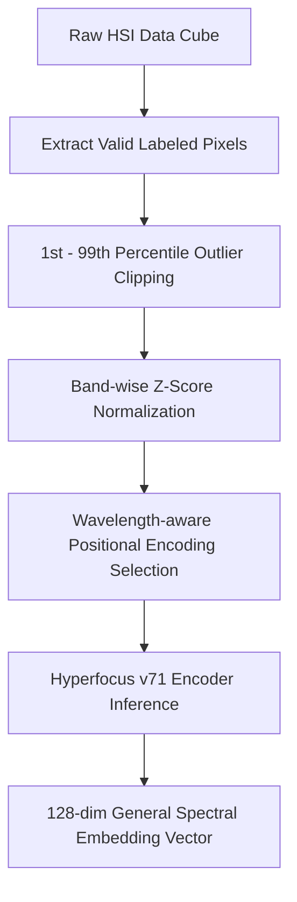

# Spectral Foundation Model v71 — 인코더 배포판

## 데이터셋 개요

평가에 사용된 5대 글로벌 데이터셋의 명세는 다음과 같습니다:

| 데이터셋 | 센서 종류 | 밴드 수 | 유효 픽셀 수 | 주요 관측 테마 / 특징 |
| :--- | :---: | :---: | :---: | :--- |
| **Indian Pines** | 항공 AVIRIS | 220 / 200 | 10,249 | 복잡한 농경지 작물류의 복잡한 간섭 극복 |
| **Botswana** | 위성 Hyperion | 145 | 3,248 | 사바나 습지대 및 수생/육생 식생 분류 |
| **Pavia University** | 항공 ROSIS | 103 | 148,152 | 단파적외선(SWIR) 결여 극복 및 고해상도 도심 격리 |
| **Pavia Centre** | 항공 ROSIS | 102 | 148,152 | 동일한 ROSIS 센서 기반 도심 격리 및 강건성 검증 |
| **HyRank (Dioni)** | 위성 Hyperion | 176 | 33,527 | 지중해 연안 식생 및 복합 도심 견고성 확보 |

## 분석 워크플로우



## 파일 구성

| 파일 | 설명 |
|------|------|
| `checkpoint_best.pth` | 사전학습된 모델 가중치 (v71) |
| `config.yaml` | 사전학습 시 사용된 설정 |
| `spectral_foundation_v2.py` | 인코더 아키텍처 정의 (`SpectralEncoderV2`) |
| `load_model.py` | 모델 로딩 유틸리티 |

## 모델 사양

| 항목 | 값 |
|------|-----|
| 파라미터 수 | 1,586,432 (약 1.59M) |
| 임베딩 차원 | 128 |
| 트랜스포머 레이어 수 | 8 |
| 어텐션 헤드 수 | 16 |
| FFN 은닉층 차원 | 512 (embed_dim × 4) |
| 기본 밴드 수 | 80 |
| 위치 인코딩 | 파장 인식 사인파 인코딩 |
| 출력 형상 | `[B, 128]` |

## 요구 사항

```
torch >= 2.0
pyyaml
```

## 모델 로드 방법

### 기본 로드 (사전학습 밴드 수 그대로 사용)

```python
from load_model import load_encoder

encoder = load_encoder()  # CPU에 로드, band_dim=80
```

### GPU에 로드

```python
encoder = load_encoder(device="cuda")
```

### 다운스트림 데이터셋의 밴드 수에 맞게 로드

사용자 데이터셋의 밴드 수가 사전학습 시의 80과 다를 경우 `band_dim`을 재설정합니다.
임베딩 레이어가 밴드별 독립 투영이므로, 밴드 수가 달라도 가중치가 호환됩니다.

```python
# 예: Indian Pines (200 밴드)
encoder = load_encoder(band_dim=200)

# 예: Urban (162 밴드)
encoder = load_encoder(band_dim=162)
```

### 실제 파장 정보 전달 (권장)

위치 인코딩이 파장 기반이므로, 데이터셋의 실제 파장을 전달하면 최적의 성능을 얻을 수 있습니다.
파장을 전달하지 않으면 400–2500 nm 범위의 선형 보간 값이 사용됩니다.

```python
import torch

# 데이터셋의 실제 파장 (nm 단위)
wavelengths = torch.tensor([400.0, 410.0, 420.0, ...])  # band_dim 개

encoder = load_encoder(
    band_dim=len(wavelengths),
    wavelengths=wavelengths,
    device="cuda",
)
```

### 별도 경로의 체크포인트 로드

```python
encoder = load_encoder(checkpoint_path="/path/to/checkpoint.pth")
```

> 체크포인트와 같은 디렉터리에 `config.yaml`이 있어야 합니다.
> 없으면 체크포인트 딕셔너리 내의 `config` 키에서 설정을 읽습니다.

## 추론 예제

```python
import torch
from load_model import load_encoder

# 인코더 로드
encoder = load_encoder(device="cuda")

# 입력: [batch_size, band_dim]
x = torch.randn(4, 80).cuda()

# 특징 추출
with torch.no_grad():
    features = encoder(x)  # [4, 128]

print(features.shape)  # torch.Size([4, 128])
```

## 다운스트림 태스크에서의 활용

인코더는 고정 크기 표현 `[B, 128]`을 출력하므로, 이를 다양한 다운스트림 태스크의
입력 특징으로 사용할 수 있습니다.

```python
import torch
import torch.nn as nn
from load_model import load_encoder

# 1. 인코더 로드 (데이터셋에 맞게 band_dim 설정)
encoder = load_encoder(band_dim=200, device="cuda")

# 2. 인코더 가중치 동결 (Linear Probing)
for param in encoder.parameters():
    param.requires_grad = False

# 3. 태스크별 헤드 추가
classifier = nn.Linear(128, num_classes).cuda()

# 4. 학습 루프
x = torch.randn(32, 200).cuda()  # 입력 스펙트럼
with torch.no_grad():
    features = encoder(x)  # [32, 128]
logits = classifier(features)     # [32, num_classes]
```

### Fine-tuning (전체 모델 학습)

인코더 가중치도 함께 업데이트하려면 `requires_grad`를 동결하지 않고 학습합니다.
이 경우 낮은 학습률 사용을 권장합니다.

```python
encoder = load_encoder(band_dim=200, device="cuda")
# requires_grad 동결 없이 바로 학습
optimizer = torch.optim.Adam(
    list(encoder.parameters()) + list(classifier.parameters()),
    lr=1e-4,  # 낮은 학습률 권장
)
```

## 검증

모델이 정상적으로 로드되는지 확인하려면 다음을 실행합니다:

```bash
python load_model.py
```

정상 출력:
```
v71 인코더 로딩 중...
인코더 로드 완료: 1,586,432 파라미터
입력:  torch.Size([4, 80])
출력: torch.Size([4, 128])
검증 통과!
```

## 아키텍처 개요

```
입력 스펙트럼 [B, band_dim]
  → Linear(1, 128): 밴드별 독립 임베딩 → [B, band_dim, 128]
  → 파장 인식 위치 인코딩 (사인파) 더하기
  → TransformerEncoder (8 레이어, 16 헤드)
  → 마스크 평균 풀링
  → 출력 표현 [B, 128]
```
