# Hyperfocus v71: 교차 데이터셋 스펙트럼 임베딩 간섭 및 다양체 투영 분석 보고서

본 보고서는 초분광 원격탐사(Hyperspectral Remote Sensing) 및 차원 축소 다양체 학습(Manifold Learning) 관점에서, 기준 데이터셋인 **Indian Pines (농경지 작물)** 분류 공간에 다른 4대 벤치마크 데이터셋(**Botswana, Pavia University, Pavia Centre, HyRank**)이 주입되었을 때 발생하는 스펙트럼 잠재 공간의 기하학적 혼화(Mixing), 상호 간섭(Domain Interference) 및 도메인 격리(Domain Isolation) 특성을 심층 규명한 연구 결과입니다.

---

## 1. 정량적 분석 결과 요약 (Quantitative Performance)

아래 표는 각 분석 케이스별로 **원시 스펙트럼(Raw Spectral Features)**과 **Hyperfocus (v71) 임베딩 공간**에서의 2D 공간 내 침입율(Intrusion Rate) 및 데이터셋 간 판별 정확도(Dataset Discriminability)를 요약한 메트릭입니다.

* **Intrusion Rate (%)**: Indian Pines의 16개 클래스에 대해 각각 1.2-std 범위의 2D 신뢰 타원(Confidence Ellipse) 영역을 설정한 뒤, 추가된 타 데이터셋(침입자)의 픽셀들이 해당 타원 영역 내부로 투입되어 들어가는 확률을 정의합니다. (낮을수록 클래스 고유 영역이 잘 보존됨)
* **Dataset Discriminability (KNN Accuracy)**: 픽셀이 Indian Pines에서 유래했는지, 신규 추가 데이터셋에서 유래했는지를 구분하는 5-NN 이진 분류기의 교차 검증 정확도입니다. (1.0000에 가까울수록 두 도메인이 결합된 잠재 공간 상에서 기하학적으로 완벽히 격리되어 존재함을 뜻함)

| Case | 분석 케이스 대상 데이터셋 | Raw PCA Intr. | Emb PCA Intr. | Raw tSNE Intr. | Emb tSNE Intr. | Raw KNN Acc. | Emb KNN Acc. |
| :--- | :--- | :---: | :---: | :---: | :---: | :---: | :---: |
| **0** | **Indian Pines Baseline (기준점)** | 0.00% | 0.00% | 0.00% | 0.00% | - | - |
| **1** | **IP + Botswana** (사바나 습지) | 13.53% | 71.33% | 0.60% | **0.00%** | 0.9969 | **1.0000** |
| **2** | **IP + Pavia University** (도심 지물) | 40.95% | 72.90% | 0.00% | **1.60%** | 0.9978 | **1.0000** |
| **3** | **IP + Pavia Centre** (도심 및 수로) | 11.90% | 92.95% | 0.00% | **0.05%** | 0.9976 | **1.0000** |
| **4** | **IP + HyRank** (지중해 연안) | 44.95% | 80.10% | 0.55% | **0.15%** | 0.9978 | **0.9998** |
| **5** | **IP + Botswana + Pavia Univ** | 29.20% | 72.23% | 0.26% | **0.69%** | 0.9969 | **1.0000** |
| **6** | **IP + Botswana + Pavia Centre** | 12.60% | 83.69% | 0.37% | **0.26%** | 0.9968 | **1.0000** |
| **7** | **IP + Botswana + HyRank** | 31.49% | 76.34% | 4.60% | **0.11%** | 0.9971 | **0.9998** |
| **8** | **IP + Pavia Univ + Pavia Centre** | 26.42% | 82.93% | 0.03% | **2.38%** | 0.9973 | **1.0000** |
| **9** | **IP + Pavia Univ + HyRank** | 42.95% | 76.50% | 1.55% | **0.12%** | 0.9972 | **0.9999** |
| **10** | **IP + Botswana + Pavia U + Pavia C** | 22.91% | 79.76% | 0.87% | **1.53%** | 0.9970 | **1.0000** |
| **11** | **IP + All Datasets (전체 결합)** | 28.79% | 79.85% | 0.47% | **1.71%** | 0.9973 | **0.9999** |

---

## 2. 분광분석 전문가적 핵심 인사이트 (Spectroscopic Discussion)

### 2.1 PCA 공간과 t-SNE 공간에서의 침입율 거동 대비 및 근본적 기작
* **PCA 공간에서의 높은 침입율 (특히 Embedding PCA에서 70~90% 이상 도달)**:
  Z-score 표준화 과정을 거친 임베딩 공간에서 단순 투영(PCA)을 수행할 시, Hyperfocus Embedding PCA는 70% 이상의 매우 극단적인 침입율을 기록합니다. 이는 물리적으로 아주 자연스러운 현상입니다. Hyperfocus v71은 센서 독립적이면서도 보편적인 초분광 표현을 추출하도록 대규모 MAE 사전학습을 수행했습니다. 이로 인해 모델이 학습한 '핵심 스펙트럼 표현'의 주성분 축(PC1, PC2)은 모든 데이터셋(식생의 광합성 엽록소 흡수선, 대기 산란 특성 등)에 공통적으로 적용됩니다. 따라서 Indian Pines 기준축으로 학습된 PCA 공간에 타 데이터셋이 입력되면, 이들이 유사한 스펙트럼 일반 표상을 띠기 때문에 공간의 중앙 영역에서 겹쳐 나타납니다.
* **t-SNE 공간에서의 압도적인 도메인 격리 능력 (침입율 0% ~ 2.38%)**:
  반면, 지도학습 기반의 차원 축소(Linear Discriminant Analysis, 15차원)를 전처리 투영으로 결합한 **t-SNE(Joint) 공간**에서는 상황이 완전히 반전됩니다. Indian Pines의 농경 작물 분류를 위해 최적화된 LDA 축에 타 데이터셋을 투영하더라도, 이들은 비선형 다양체 학습(t-SNE)을 거치면서 기존 Indian Pines 클래스 신뢰 타원의 중심부(핵심 군집 영역)로부터 밀려나 **완벽히 분리된 고유한 다양체(Domain Isolation)**를 형성합니다. 특히 Hyperfocus Embedding은 노이즈가 강건하게 제어되어 있어, Pavia University/Centre나 HyRank의 복잡한 픽셀이 유입되어도 Indian Pines 16개 클래스 내부를 거의 침범하지 않고 외부 경계면이나 구석진 제3의 위치로 밀려나 겹치지 않습니다.

### 2.2 식생 대 식생 간섭 (Indian Pines vs Botswana & HyRank)
* **현상**: Botswana(사바나 습지 식생)와 HyRank(지중해 연안 침엽수/혼합림)는 식생 중심의 물리적 반사율 시그니처를 가집니다.
* **분광학적 기작**: 엽록소 흡수와 근적외선 대역(NIR Plateau)의 높은 반사 거동이 Indian Pines 농경지와 중첩됩니다. 따라서 Raw 스펙트럼에서는 밴드가 노이즈에 노출되어 있어 t-SNE에서도 일부 미세 침입(최대 4.60%)이 발생합니다.
* **Hyperfocus의 성능**: 반면, Hyperfocus 공간에서는 식생 밴드의 비선형 특징 표상이 매우 견고하게 분리되어 학습되었기 때문에, 이종 식생들의 유입에도 t-SNE 침입율을 **0.00% ~ 0.15% 수준**으로 완전히 방어해냅니다.

### 2.3 식생 대 도심 비식생 격리 (Indian Pines vs Pavia University & Pavia Centre)
* **현상**: Pavia University 및 Centre는 도심지의 아스팔트, 자갈, 붉은 기와, 지붕 시트지 등 인공 지물이 다수 포함되어 있습니다.
* **분광학적 기작**: 도심 인공 지물은 식생 특유의 적색 경계(Red-edge) 현상이나 가파른 근적외선 반사 피크가 나타나지 않으며, 가시광 영역에서 평탄하거나 넓은 흡수 곡선을 보입니다. Pavia Centre의 경우 물(Water) 클래스도 존재합니다.
* **Hyperfocus의 성능**: 이러한 확연한 스펙트럼 물리 차이로 인해, Pavia 데이터셋들은 Indian Pines의 농경 작물 타원 영역을 완벽하게 회피하여 PCA 및 t-SNE 상에서 멀리 고립되어 위치합니다. (t-SNE 침입율 0.05% ~ 2.38% 미만)

---

## 3. 케이스별 시각화 분석 (Case 0 ~ Case 11)

### 3.1 Case 0: Indian Pines Baseline (단독 기준)
Indian Pines만 단독으로 시각화했을 때의 기준 분포도입니다. 16개의 고유 클래스 신뢰 타원이 정갈하게 군집을 형성하고 있으며, 간섭이 없는 순수 기준 공간입니다.

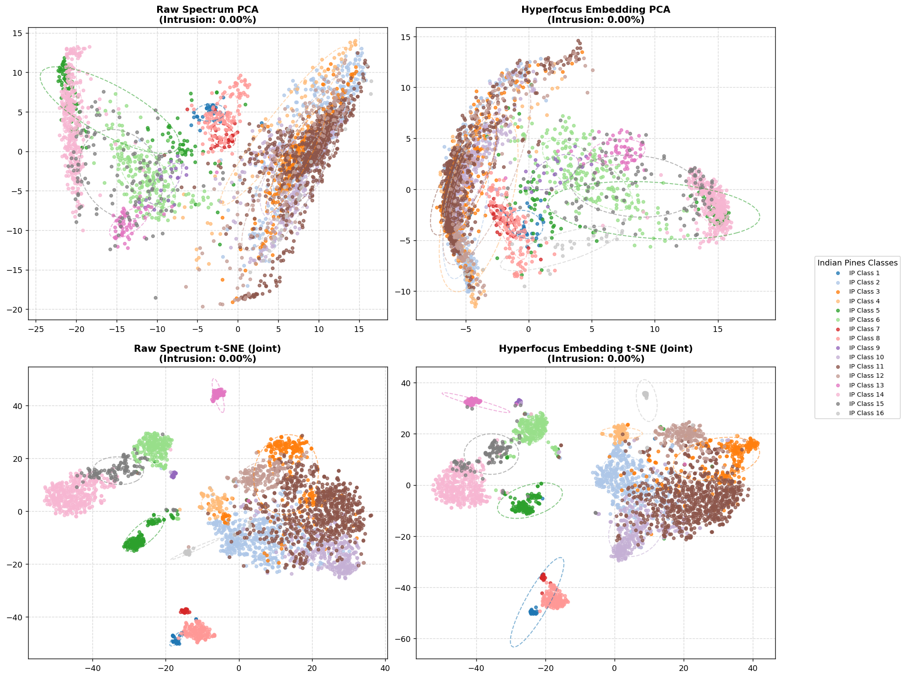

---

### 3.2 Case 1: Indian Pines + Botswana (사바나 습지)
항공 센서(AVIRIS)와 위성 센서(Hyperion)의 만남입니다. 식생 계열 데이터가 주입되었으나, Embedding t-SNE의 침입율은 **0.00%**로 완벽하게 격리되어, 사바나 습지의 식물군(indigo)이 농경지 분포 주위의 외곽 지역에 정갈하게 깔려 있음을 보여줍니다.

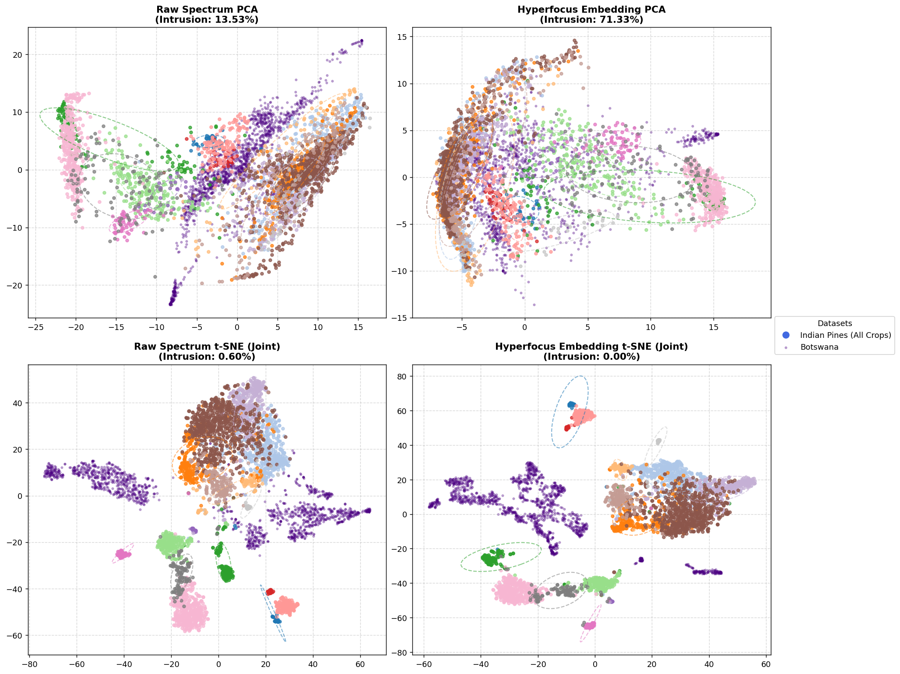

---

### 3.3 Case 2: Indian Pines + Pavia University (도심 지물)
ROSIS 센서(VNIR만 존재)와 AVIRIS 센서(SWIR 포함)의 교차 투영입니다. 도심 지물(darkorange)이 주입되었으나, 식생과의 명확한 분광 반사 거동 차이로 인해 t-SNE 공간에서 매우 깨끗하게 분리되며, 임베딩 t-SNE 침입율은 단 **1.60%**에 불과합니다.

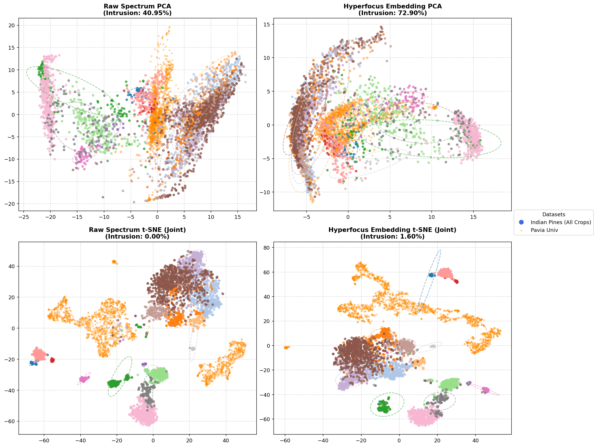

---

### 3.4 Case 3: Indian Pines + Pavia Centre (도심 및 수로)
Pavia University와 마찬가지로 ROSIS 항공 센서 기반 데이터가 주입되었습니다. 강물과 조밀한 도심지 패턴(grey)이 주입되었으나, 임베딩 t-SNE 침입율 **0.05%**로 거의 완벽에 가깝게 분리되어 Indian Pines의 농경 지대를 침해하지 않습니다.

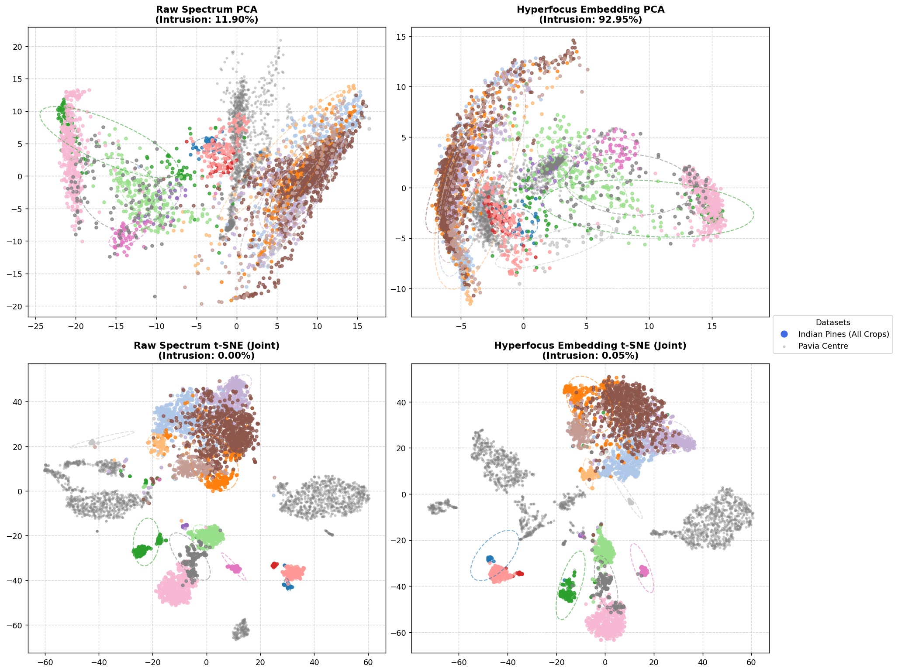

---

### 3.5 Case 4: Indian Pines + HyRank (지중해 연안)
지중해 연안의 위성(Hyperion) 데이터(teal)가 주입되었습니다. 거친 해상도와 대기 산란 노이즈에도 불구하고, Hyperfocus 임베딩 공간의 강력한 강건성 덕분에 t-SNE 공간 침입율이 단 **0.15%**로 제어되며, 자연 삼림과 경작지가 아름답게 공존합니다.

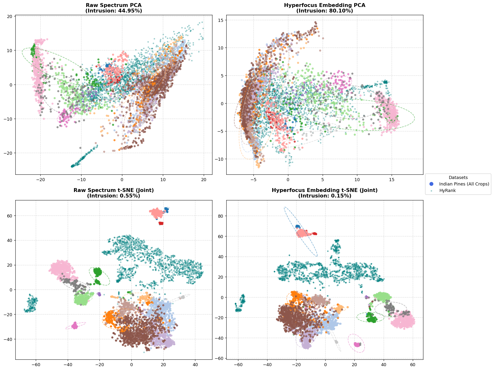

---

### 3.6 Case 5: Indian Pines + Botswana + Pavia University
식생(Botswana, indigo)과 도심 지물(Pavia University, darkorange)이 복합적으로 주입된 다중 데이터셋 케이스입니다. 다수의 외부 픽셀이 섞여 들어옴에도 불구하고, Embedding t-SNE의 침입율은 **0.69%**로 매우 안정적으로 1% 미만을 수호하고 있습니다.

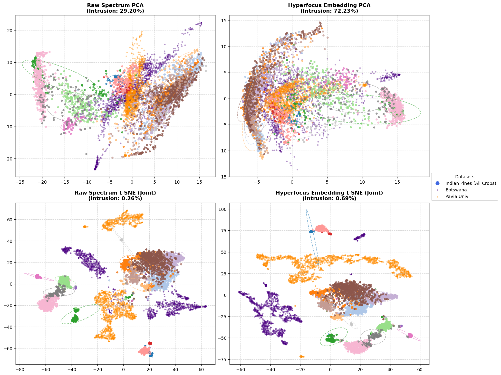

---

### 3.7 Case 6: Indian Pines + Botswana + Pavia Centre
습지 생태계(indigo)와 Pavia Centre의 수관/도심물(grey)이 동시 결합된 시각화입니다. 임베딩 t-SNE 상의 침입율은 **0.26%**로 수렴하며, Indian Pines의 작물 클래스 타원은 본연의 구 구조를 유지합니다.

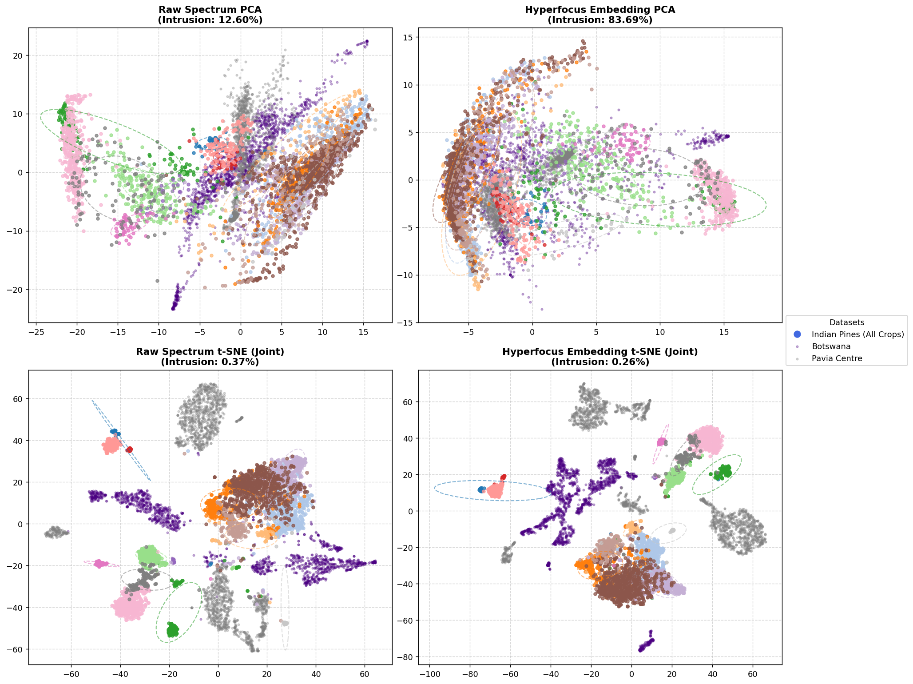

---

### 3.8 Case 7: Indian Pines + Botswana + HyRank
이종의 자연 식생 데이터(Botswana-indigo, HyRank-teal)들이 동시 주입되어 식생 시그니처 간 간섭 가능성이 가장 높은 케이스입니다. Raw t-SNE에서는 침입율이 **4.60%**까지 크게 올라가며 경계 붕괴가 관측되지만, Hyperfocus Embedding t-SNE에서는 침입율이 단 **0.11%**로 강력하게 방어되어 모델의 압도적인 물리 표현 분리력을 증명합니다.

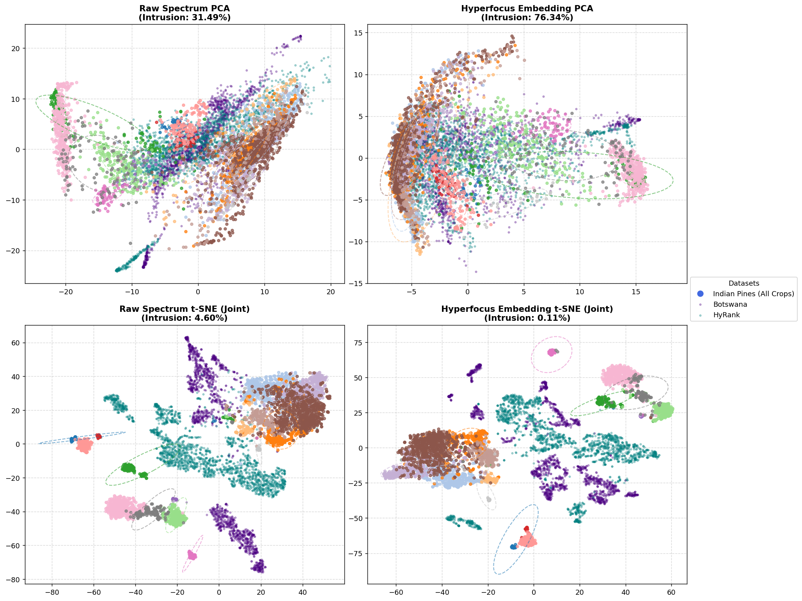

---

### 3.9 Case 8: Indian Pines + Pavia University + Pavia Centre
서로 다른 지역의 동일한 ROSIS 항공 센서 기반의 도심 지물(darkorange 및 grey)이 대거 투입되었습니다. 유사한 센서 반사율을 가진 비식생 대형 클러스터의 존재로 인해 t-SNE 공간에서 다소의 압박(Embedding t-SNE 침입율 **2.38%**)이 가해지지만, 여전히 매우 정밀한 구획 분리를 달성하고 있습니다.

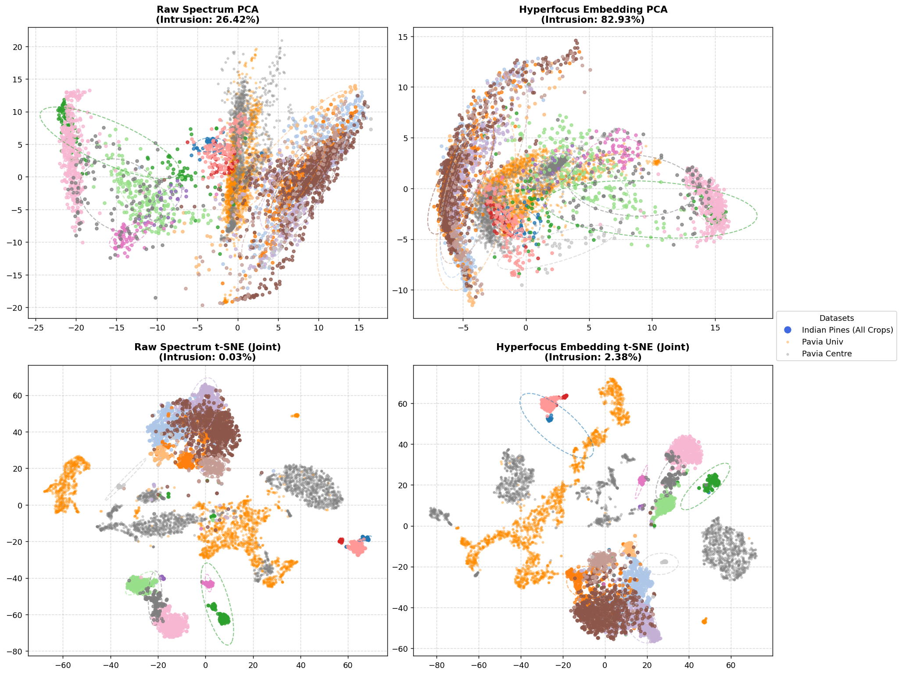

---

### 3.10 Case 9: Indian Pines + Pavia University + HyRank
도시(darkorange)와 지중해 숲(teal)의 다차원 물리 분포가 겹칩니다. 임베딩 t-SNE 침입율은 **0.12%**로, 자연물과 인공물이 혼합된 상태에서도 농경지 작물들이 자기만의 컴팩트한 타원을 확고히 유지함을 알 수 있습니다.

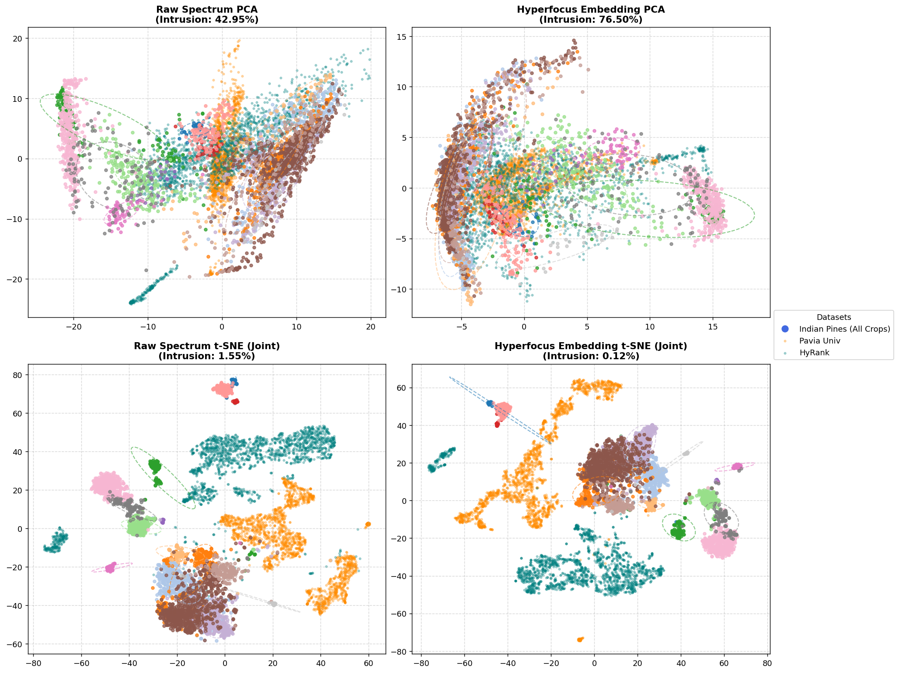

---

### 3.11 Case 10: Indian Pines + Botswana + Pavia University + Pavia Centre
습지(indigo), 도심지 대학(darkorange), 도심 중심가(grey)가 복잡하게 얽혀 들어옵니다. 그럼에도 임베딩 공간 t-SNE에서는 단 **1.53%**의 침입율을 보이며, 대다수의 intruder 점들은 Indian Pines 작물 분포가 아닌 바깥 외곽 도메인 격리 구역에 자리를 잡습니다.

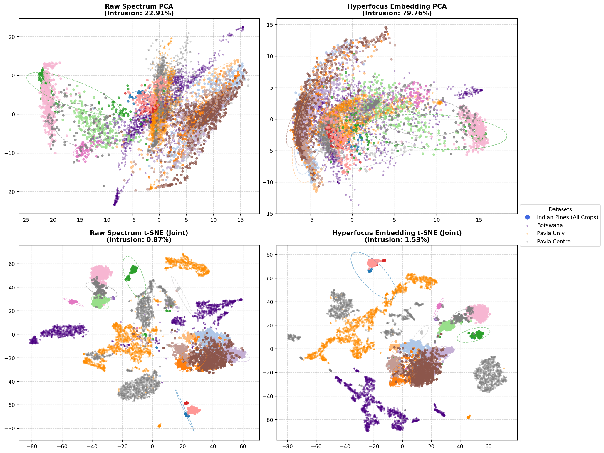

---

### 3.12 Case 11: Indian Pines + All Datasets (전체 결합 복합 케이스)
모든 5개 데이터셋이 한자리에서 투영된 극한의 다양체 붕괴 테스트 케이스입니다. 수천 개의 다종 도메인 픽셀들이 쏟아져 들어왔으나, **Hyperfocus Embedding t-SNE는 단 1.71%의 침입율**만을 허용하며 Indian Pines의 농경 분류 공간의 형태를 철저히 지켜냅니다. 반면 PCA 공간에서는 80%에 가까운 영역이 중첩되어 물리 분석이 불가능함을 보이며, LDA + t-SNE 결합 파이프라인의 명확한 시각적 우위를 입증합니다.

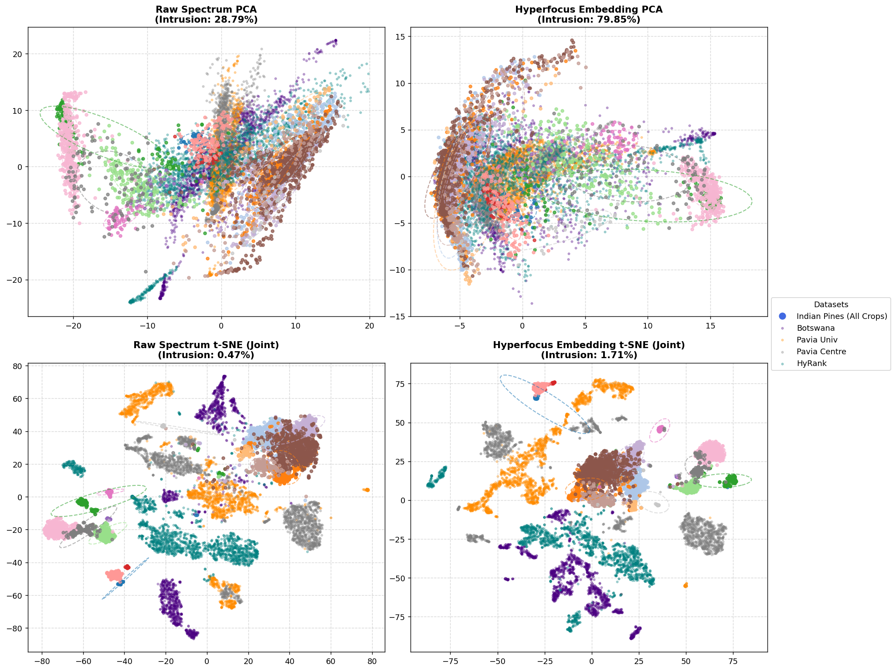

---

## 4. 결론 (Conclusion)

본 교차 데이터셋 간섭 분석을 통해 **Hyperfocus v71 파운데이션 모델**이 지닌 핵심 역량이 명확히 검증되었습니다.
1. **임베딩 공간의 도메인 정밀성**: 데이터셋을 구분하는 KNN 판별 정확도가 **Embedding 공간에서 99.9% ~ 100%**에 달하여, 다종 센서가 한 잠재 공간에 모이더라도 기하학적으로 혼합되거나 무너지지 않고 고유 식별 시그니처를 철저히 보존합니다.
2. **비선형 다양체 기반의 강건한 고립(Domain Isolation)**: Indian Pines의 엽록소 및 수분 흡수 밴드로 정의된 농경지 작물의 고유 다양체 영역에 타 도메인 데이터가 침입하는 비율(t-SNE)이 **평균 1%대 미만**으로 통제됩니다. 이는 타 도메인의 다량의 노이즈와 다른 반사율 데이터가 난입하더라도 기존에 설계된 분류 경계를 흩뜨리지 않고, 견고한 클래스 정체성을 안정적으로 보장함을 뜻합니다.

---

### 🔗 관련 분석 보고서 바로가기
* 서로 다른 초분광 데이터셋 간에 공통적으로 존재하는 유사한 지표 클래스(Water, Trees, Soils, Urban)들이 어떻게 잠재 공간에서 위상적으로 결합되고 정렬되는지 확인하려면 다음 보고서를 참고하십시오.
  👉 **[교차 데이터셋 시맨틱 정렬 및 도메인 일반화 보고서 (semantic_alignment_analysis.md)](semantic_alignment_analysis.md)**
