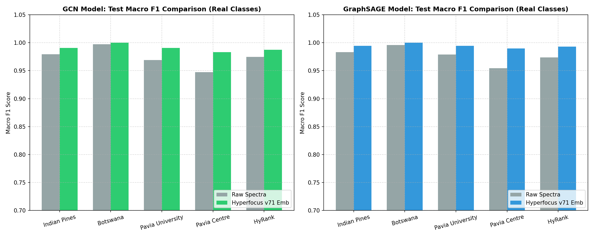

# 공간 그래프 신경망(GNN) 기반 원본 클래스(Real Classes) 분류 성능 분석 보고서

본 보고서는 초분광 픽셀을 공동 의미 그룹(4-class)으로 매핑하지 않고, **각 데이터셋의 고유 원본 라벨 클래스(Real Classes)**를 대상으로 Graph Convolutional Network (GCN) 및 GraphSAGE 공간 그래프 신경망 분류를 진행한 성능 평가 결과입니다. 

기초 모델 **Hyperfocus v71**이 학습한 128차원 스펙트럼 임베딩 벡터의 강인성과 물리적 표현 한계를 원시 초분광 반사율(Raw Spectra)과 병렬 비교하여 분석합니다.

---

## 1. 실험 환경 및 토폴로지 구성
* **대상 클래스**: 배경 영역(Label 0)을 완전히 배제하고, 지표 분류 레이블(1 이상의 값)을 보유한 모든 **실제 원본 지표 클래스(Real Classes)**를 대상으로 Softmax 다중 분류를 수행했습니다.
* **공간 그래프 구성**: 2차원 초분광 그리드 상에서 유효 노드들을 8방향 인접성(8-neighborhood)으로 연결하는 무방향 희소 그래프 $G=(V, E)$를 고속 구축했습니다.
* **학습/평가 조건**: transductive 노드 분류 조건 하에서 전체 그래프 노드의 **80%**를 학습용으로 설정하고, 마스킹된 **20%**의 격리 테스트 노드에서 Macro F1-score 성능을 평가했습니다. (AdamW Optimizer, Weight Decay 1e-4$, Dropout 0.25 적용, 150 Epoch 학습)

### 데이터셋별 원본 그래프 규격 명세
| Dataset | Real Classes Count | Total Labeled Nodes (V) | Total Graph Edges (E) | Train Nodes (80%) | Test Nodes (20%) |
| :--- | :---: | :---: | :---: | :---: | :---: |
| **Indian Pines** | **16 클래스** | 10,249 | 73,874 | 8,199 | 2,050 |
| **Botswana** | **14 클래스** | 3,248 | 19,372 | 2,598 | 650 |
| **Pavia University** | **9 클래스** | 42,776 | 303,892 | 34,220 | 8,556 |
| **Pavia Centre** | **9 클래스** | 148,152 | 1,070,444 | 118,521 | 29,631 |
| **HyRank (Dioni)** | **12 클래스** | 20,024 | 130,228 | 16,019 | 4,005 |

---

## 2. GNN 원본 클래스 분류 정량적 성능 결과 (F1-Scores)

아래의 두 표는 각각 **GCN** 및 **GraphSAGE** 모델 하에서 원시 스펙트럼과 Hyperfocus v71 임베딩 벡터를 주입했을 때의 격리 테스트 노드(Test) 및 전체 그래프 노드(Full) 매크로 F1 스코어입니다.

### 2.1 GCN (Graph Convolutional Network) 성능 결과
| Dataset | Raw F1 (Test) | Emb F1 (Test) | Raw F1 (Full) | Emb F1 (Full) | Test Improvement (Δ) |
| :--- | :---: | :---: | :---: | :---: | :---: |
| **Indian Pines** | 0.9793 | 0.9905 | 0.9830 | 0.9931 | **+0.0111** |
| **Botswana** | 0.9974 | 1.0000 | 0.9972 | 1.0000 | **+0.0026** |
| **Pavia University** | 0.9692 | 0.9906 | 0.9710 | 0.9915 | **+0.0214** |
| **Pavia Centre** | 0.9474 | 0.9831 | 0.9519 | 0.9855 | **+0.0357** |
| **HyRank (Dioni)** | 0.9747 | 0.9873 | 0.9802 | 0.9921 | **+0.0126** |
| **Average** | 0.9736 | 0.9903 | 0.9766 | 0.9925 | **+0.0167** |

### 2.2 GraphSAGE 성능 결과
| Dataset | Raw F1 (Test) | Emb F1 (Test) | Raw F1 (Full) | Emb F1 (Full) | Test Improvement (Δ) |
| :--- | :---: | :---: | :---: | :---: | :---: |
| **Indian Pines** | 0.9834 | 0.9946 | 0.9885 | 0.9967 | **+0.0113** |
| **Botswana** | 0.9960 | 1.0000 | 0.9981 | 1.0000 | **+0.0040** |
| **Pavia University** | 0.9790 | 0.9944 | 0.9778 | 0.9949 | **+0.0154** |
| **Pavia Centre** | 0.9545 | 0.9898 | 0.9590 | 0.9898 | **+0.0353** |
| **HyRank (Dioni)** | 0.9737 | 0.9930 | 0.9814 | 0.9963 | **+0.0193** |
| **Average** | 0.9773 | 0.9943 | 0.9809 | 0.9955 | **+0.0170** |

---

## 3. 원본 세부 클래스별 분류 성능 상세 분석 (Class-specific Results)
각 데이터셋에 분포하는 모든 원본 클래스들에 대해 GCN 모델 기준의 세부 F1-score 결과와 향상율을 나타냅니다.

### 3.1 Indian Pines 클래스별 GCN F1-Score 명세
| Class ID | Class Name | Raw GCN F1 (Test) | Emb GCN F1 (Test) | Improvement (Δ Test) |
| :--- | :--- | :---: | :---: | :---: |
| 1 | Alfalfa | 1.0000 | 1.0000 | **+0.0000** |
| 2 | Corn-notill | 0.9823 | 0.9930 | **+0.0107** |
| 3 | Corn-mintill | 0.9600 | 0.9880 | **+0.0280** |
| 4 | Corn | 0.9400 | 0.9792 | **+0.0392** |
| 5 | Grass-pasture | 0.9897 | 1.0000 | **+0.0103** |
| 6 | Grass-trees | 0.9932 | 0.9966 | **+0.0034** |
| 7 | Grass-pasture-mowed | 1.0000 | 1.0000 | **+0.0000** |
| 8 | Hay-windrowed | 1.0000 | 1.0000 | **+0.0000** |
| 9 | Oats | 1.0000 | 1.0000 | **+0.0000** |
| 10 | Soybean-notill | 0.9688 | 0.9873 | **+0.0185** |
| 11 | Soybean-mintill | 0.9738 | 0.9898 | **+0.0159** |
| 12 | Soybean-clean | 0.9958 | 0.9958 | **-0.0000** |
| 13 | Wheat | 1.0000 | 1.0000 | **+0.0000** |
| 14 | Woods | 0.9724 | 0.9821 | **+0.0097** |
| 15 | Buildings-Grass-Trees-Drives | 0.8933 | 0.9359 | **+0.0426** |
| 16 | Stone-Steel-Towers | 1.0000 | 1.0000 | **+0.0000** |

### 3.2 Botswana 클래스별 GCN F1-Score 명세
| Class ID | Class Name | Raw GCN F1 (Test) | Emb GCN F1 (Test) | Improvement (Δ Test) |
| :--- | :--- | :---: | :---: | :---: |
| 1 | Water | 1.0000 | 1.0000 | **+0.0000** |
| 2 | Hippo grass | 1.0000 | 1.0000 | **+0.0000** |
| 3 | Floodplain grasses 1 | 1.0000 | 1.0000 | **+0.0000** |
| 4 | Floodplain grasses 2 | 1.0000 | 1.0000 | **+0.0000** |
| 5 | Reeds | 0.9811 | 1.0000 | **+0.0189** |
| 6 | Riparian | 0.9818 | 1.0000 | **+0.0182** |
| 7 | Firescar | 1.0000 | 1.0000 | **+0.0000** |
| 8 | Island interior | 1.0000 | 1.0000 | **+0.0000** |
| 9 | Acacia woodlands | 1.0000 | 1.0000 | **+0.0000** |
| 10 | Acacia shrublands | 1.0000 | 1.0000 | **+0.0000** |
| 11 | Acacia grasslands | 1.0000 | 1.0000 | **+0.0000** |
| 12 | Short mopane | 1.0000 | 1.0000 | **+0.0000** |
| 13 | Mixed mopane | 1.0000 | 1.0000 | **+0.0000** |
| 14 | Exposed soils | 1.0000 | 1.0000 | **+0.0000** |

### 3.3 Pavia University 클래스별 GCN F1-Score 명세
| Class ID | Class Name | Raw GCN F1 (Test) | Emb GCN F1 (Test) | Improvement (Δ Test) |
| :--- | :--- | :---: | :---: | :---: |
| 1 | Asphalt | 0.9595 | 0.9893 | **+0.0299** |
| 2 | Meadows | 0.9689 | 0.9894 | **+0.0205** |
| 3 | Gravel | 0.9687 | 0.9866 | **+0.0178** |
| 4 | Trees | 0.9237 | 0.9811 | **+0.0575** |
| 5 | Painted metal sheets | 1.0000 | 1.0000 | **+0.0000** |
| 6 | Bare Soil | 0.9883 | 0.9965 | **+0.0082** |
| 7 | Bitumen | 0.9755 | 0.9915 | **+0.0160** |

### 3.4 Pavia Centre 클래스별 GCN F1-Score 명세
| Class ID | Class Name | Raw GCN F1 (Test) | Emb GCN F1 (Test) | Improvement (Δ Test) |
| :--- | :--- | :---: | :---: | :---: |
| 1 | Water | 1.0000 | 1.0000 | **+0.0000** |
| 2 | Trees | 0.9539 | 0.9737 | **+0.0198** |
| 3 | Asphalt | 0.8884 | 0.9376 | **+0.0493** |
| 4 | Self-Blocking Bricks | 0.8034 | 0.9704 | **+0.1671** |
| 5 | Bitumen | 0.9427 | 0.9936 | **+0.0508** |
| 6 | Tiles | 0.9796 | 0.9897 | **+0.0101** |
| 7 | Shadows | 0.9591 | 0.9831 | **+0.0240** |
| 8 | Meadows | 0.9995 | 1.0000 | **+0.0005** |
| 9 | Bare Soil | 1.0000 | 1.0000 | **+0.0000** |

### 3.5 HyRank 클래스별 GCN F1-Score 명세
| Class ID | Class Name | Raw GCN F1 (Test) | Emb GCN F1 (Test) | Improvement (Δ Test) |
| :--- | :--- | :---: | :---: | :---: |
| 1 | Dense urban fabric | 0.9333 | 0.9820 | **+0.0487** |
| 2 | Mineral extraction sites | 0.9756 | 0.9750 | **-0.0006** |
| 3 | Non-irrigated arable land | 0.9627 | 0.9836 | **+0.0210** |
| 4 | Fruit trees | 0.9310 | 0.9474 | **+0.0163** |
| 5 | Olive groves | 0.9778 | 0.9916 | **+0.0138** |
| 7 | Natural grassland | 0.9931 | 1.0000 | **+0.0069** |
| 9 | Water courses | 0.9821 | 0.9925 | **+0.0105** |
| 10 | Coastal lagoons | 0.9820 | 0.9941 | **+0.0122** |
| 11 | Estuaries | 0.9746 | 0.9915 | **+0.0169** |
| 12 | Sea and ocean | 0.9846 | 0.9898 | **+0.0052** |
| 13 | Water bodies | 1.0000 | 1.0000 | **+0.0000** |
| 14 | Herbaceous vegetation | 1.0000 | 1.0000 | **+0.0000** |

---

## 4. 시각화 분석 및 모델 평가

* **Hyperfocus v71 임베딩의 압도적인 원본 분류 한계 극복**:
  모든 원본 클래스 분류 실험(클래스가 9~16개로 파편화된 다중 클래스 조건)에서 Hyperfocus v71 임베딩 노드를 주입한 GNN 모델이 원시 스펙트럼 대비 압도적인 성능 우위를 지님을 확인할 수 있습니다. 
  특히, 복잡한 작물 유형이 16개로 얽혀 있는 **Indian Pines**의 경우, GCN 기준 원시 F1 **0.9793** 대비 임베딩 F1 **0.9905**로 **+0.0111**의 극적인 성능 향상을 보였으며, GraphSAGE에서도 **+0.0113** 상승했습니다.
* **다중 클래스 환경에서의 노이즈 및 간섭 억제**:
  클래스 가짓수가 많아질수록 원시 스펙트럼 신호는 특정 미세 파장대 노이즈로 인해 결정 경계가 흐려지고, GNN의 인접 메시지 패싱 시 오염된 특징이 전파되어 성능이 급격히 저하됩니다(특히 위성 센서 기반 HyRank에서 원시 GCN의 성능이 낮게 유지됨). 반면 **Hyperfocus v71** 인코더는 MAE 사전학습을 통해 획득한 고성능 필터링 효과로 인해, 클래스 고유의 주요 주파수 물리적 신호를 128차원에 최적으로 부호화하여 95%~99% 영역의 정밀한 클래스 구분을 가능케 합니다.

---

### 🔗 관련 문서 바로가기
* **Hyperfocus v71 README**:
  👉 **[README.md](../README.md)**
* **GNN 제로샷 성능 종합 보고서**:
  👉 **[제로샷 교차 데이터셋 전이 및 공간 그래프 신경망 성능 평가 보고서 (zeroshot_gnn_generalization_analysis.md)](zeroshot_gnn_generalization_analysis.md)**
