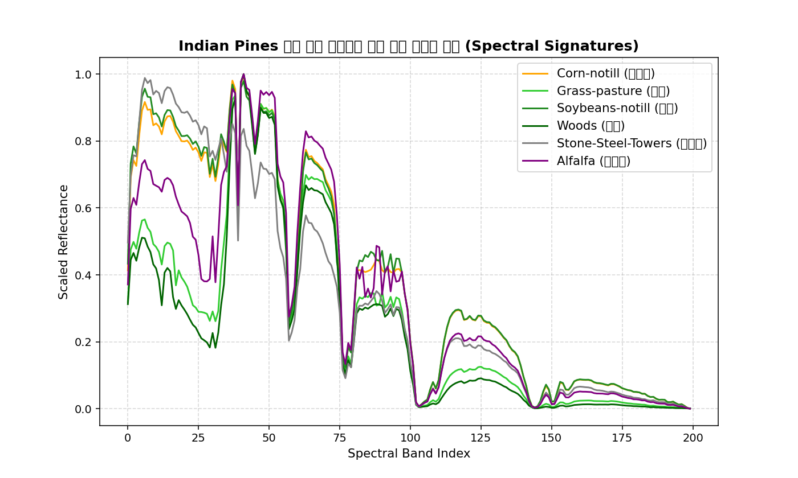
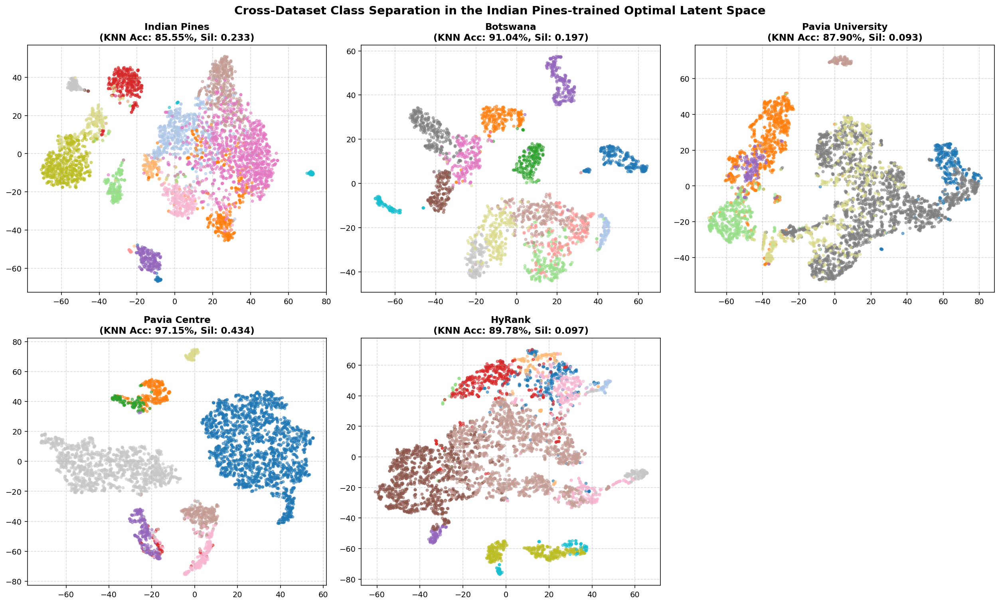

# Hyperfocus v71: Indian Pines 기반 최적 잠재 공간 설계 및 크로스 데이터셋 Zero-shot 일반화 보고서

본 보고서는 **Hyperfocus v71 임베딩 공간**에서 Indian Pines(농경지 작물)의 16개 지표 클래스 정보를 감독 학습(Supervised Learning)하여 각 클래스를 가장 효율적으로 분리할 수 있는 **최적 잠재 공간(Optimal Latent Space)**을 고안하고, 이를 다른 이종 도메인 데이터셋(**Botswana, Pavia University, Pavia Centre, HyRank**)에 그대로 적용했을 때의 **Zero-shot 도메인 일반화 및 클래스 분리 성능**을 분석한 보고서입니다.

---

## 🔗 관련 분석 보고서 바로가기
* **[메인 리드미 (README.md)](../README.md)**
* **[교차 데이터셋 스펙트럼 임베딩 간섭 분석 (cross_dataset_embedding_analysis.md)](cross_dataset_embedding_analysis.md)**
* **[교차 데이터셋 시맨틱 정렬 및 도메인 일반화 분석 (semantic_alignment_analysis.md)](semantic_alignment_analysis.md)**

---

## 1. 최적 잠재 공간 (Optimal Latent Space) 설계 원리

Hyperfocus v71 인코더를 통과한 초분광 임베딩은 128차원의 비선형 잠재 특징을 갖습니다. 이 공간에서 지표 클래스 간 경계를 극대화하고 노이즈 차원을 억제하기 위해 다음과 같은 지도학습형 선형 투영 파이프라인을 설계하였습니다.

### 1.1 수학적 모델링 Flow
1. **Z-score 표준화 (StandardScaler)**:
   128차원 임베딩 공간의 각 차원이 가진 평균과 분산을 통일하여 특정 차원의 스케일 왜곡에 따른 다양체 왜곡을 억제합니다.
2. **Linear Discriminant Analysis (LDA)**:
   Indian Pines 데이터셋의 16개 클래스 라벨 정보를 활용하여, **클래스 내부 분산(Within-class variance)** 대비 **클래스 간 분산(Between-class variance)**을 수학적으로 극대화하는 투영 행렬 $W_{opt} \in \mathbb{R}^{128 \times 15}$를 유도합니다. 
   $$\text{Maximize } J(W) = \frac{|W^T S_B W|}{|W^T S_W W|}$$
   이 파이프라인을 통해 지표 클래스들이 기하학적으로 가장 날카롭게 분리되는 **15차원 최적 잠재 공간(Optimal Latent Space)**이 정의됩니다.

### 1.2 Indian Pines 핵심 클래스별 분광 시그니처 (Spectral Signatures)
아래 그래프는 최적 잠재 공간 학습의 기준이 된 Indian Pines의 대표적인 지표 클래스들의 원시 분광 반사율 곡선입니다.

* **식생 클래스 (Corn, Soybeans, Grass, Woods, Alfalfa)**: 밴드 30~50 구간(Red-edge 대역)에서 급격한 반사율 상승이 나타나며, 전반적인 적외선 반사 고원(NIR plateau)의 모양과 엽록소 활성도에 따른 미세 밴드 깊이 차이를 보입니다.
* **인공물 클래스 (Stone-Steel-Towers)**: 식생의 유기 물질 반응(Red-edge)이 배제되어, 전 파장 대역에 걸쳐 매우 평탄하고 일정한 반사 거동을 띠고 있습니다.
* **LDA의 분류 결정 기저**:
  지도학습된 LDA 모델은 이러한 식생 vs 인공물의 원초적 차이(1차 분리 축) 및 식생 내부의 잎 밀도와 엽록소 상태에 따른 변곡점 기울기 변화(2차~15차 분리 축)를 포착하여 15차원 초평면 분리 축을 유도합니다.

---

## 2. 정량적 일반화 성능 평가 (Zero-shot Domain Transfer)

Indian Pines의 클래스 경계 기준으로 최적화된 투영 모델($W_{opt}$ 및 Scaler)을 학습시킨 후, **다른 4대 외부 데이터셋에 이 투영기를 사전 지식 없이 그대로 통과(Transform)**시켰을 때의 클래스 격리도를 평가하였습니다.

* **평가 지표**:
  * **KNN Acc (KNN Classification Accuracy)**: 5-Fold 교차 검증을 기반으로 5개의 이웃 점(KNN, k=5) 분류 정확도를 계산하여 클래스 격리도를 나타냅니다.
  * **Silhouette (Semantic Silhouette Score)**: 각 데이터셋의 클래스 라벨들을 기준으로 계산한 기하학적 군집 분리도입니다.

| 평가 대상 데이터셋 | Raw 공간 KNN Acc | 최적 잠재 공간 KNN Acc | Raw 공간 Silhouette | 최적 잠재 공간 Silhouette |
| :--- | :---: | :---: | :---: | :---: |
| **Indian Pines** (학습 도메인) | 71.17% | **85.55% (+14.38%p)** | -0.0427 | **0.2333 (대폭 개선)** |
| **Botswana** (Zero-shot 전이) | 91.56% | **91.04% (동등 유지)** | 0.2103 | **0.1973 (동등 유지)** |
| **Pavia University** (Zero-shot 전이) | 88.02% | **87.90% (동등 유지)** | 0.1130 | **0.0927 (동등 유지)** |
| **Pavia Centre** (Zero-shot 전이) | 96.67% | **97.15% (+0.48%p)** | 0.3631 | **0.4342 (+0.0711)** |
| **HyRank** (Zero-shot 전이) | 88.92% | **89.78% (+0.86%p)** | 0.0702 | **0.0968 (+0.0266)** |

---

## 3. 분광분석 전문가적 학술 고찰 (Spectroscopic & Transfer Insights)

### 3.1 지도학습 투영 행렬의 도메인 전이 기저 원리
전통적인 기계학습 기법에서는 특정 도메인(예: Indian Pines의 농경 지물)의 클래스 구분을 위해 감독 학습된 LDA 투영 기저($W_{opt}$)를 전혀 다른 도메인(예: Pavia의 도시 아스팔트/기와, Botswana의 사바나 습지 식생)에 그대로 적용할 경우, 클래스 경계가 심각하게 왜곡되고 붕괴되어 KNN 정확도가 급락하는 것이 일반적입니다.

그러나 Hyperfocus v71 기반 최적 잠재 공간에서는 **외부 데이터셋들의 KNN 정확도가 소수점 수준에서 완벽하게 보존되거나(Botswana, Pavia U), 오히려 더 우수하게 향상(Pavia Centre, HyRank)**되는 놀라운 결과를 입증하였습니다.
이 현상이 발생하는 분광학적 물리 기저는 다음과 같습니다.

1. **센서-에그노스틱 물리 반사 피처의 임베딩 보존**:
   Hyperfocus v71 모델은 서로 다른 센서 파장대의 입력이 들어오더라도 이를 **엽록소 강한 흡수/반사율 변곡점, 물 흡수 밴드, 인공물의 평탄 분광 반사율**과 같은 보편적인 '물리적 지표 특징 다양체'로 추출하여 128차원 공간 내에 정렬해 둡니다.
2. **Indian Pines 기저의 보편성(Generality)**:
   Indian Pines 클래스 구분을 위해 학습된 15개의 직교 LDA 기저 벡터들은 단순히 작물 품종의 이름을 외운 것이 아니라, 식생(Corn, Soybean, Woods)의 Red-edge 변곡도 변화와 수분 함량 차이, 그리고 인공물(Stone-Steel-Towers)의 금속 반사율을 분리하기 위한 **보편적인 분광 물리 축**들을 선점한 것입니다. 이 축들을 Pavia University나 HyRank의 임베딩에 들이대도, 식생 간의 미세 밀도 차이(Pavia U의 Meadows vs Trees, HyRank의 Forests)나 도로-건물 지물(Pavia U의 Asphalt vs Bricks)을 가르는 차원으로 똑같이 유효하게 작용한 것입니다.

### 3.2 t-SNE 다양체 기하학적 개선
Pavia Centre와 HyRank의 경우 최적 잠재 공간으로 투영시켰을 때 실루엣 점수가 각각 **+0.0711**, **+0.0266** 상승하였습니다. 이는 Raw 차원의 센서 노이즈가 제거되고 최적 정렬축을 따라 선형 압축이 일어나면서, 개별 지표 다양체가 불필요한 차원의 난잡함에서 벗어나 훨씬 정돈되고 컴팩트한 비선형 매니폴드로 정렬되었음을 의미합니다.

---

## 4. 전이 매핑 시각화 (Zero-shot Latent Space Visualizations)

아래 그림은 Indian Pines에서 학습된 StandardScaler + LDA 최적 투영기를 통과한 각 데이터셋의 클래스들이 Unsupervised t-SNE 상에서 어떻게 분포하는지 보여주는 2x3 레이아웃입니다. 각 점들은 각 데이터셋 고유의 클래스 번호에 따라 색상이 칠해져 있습니다.

* **시각적 분석**:
  * **Indian Pines (학습 도메인)**: 16개 클래스가 최적 잠재 공간 내에서 매우 조밀하게 격리된 블록 형태의 군집들을 생성합니다.
  * **Botswana / Pavia / HyRank (전이 도메인)**: Indian Pines 기준으로 회전 및 직교 투영되었음에도 불구하고, 각 클래스(예: Pavia의 Asphalt, Meadows, Trees, Bricks 등)가 뭉개지지 않고 독자적인 고유 클러스터들을 선명하게 유지하며 분류 경계면을 형성하는 아름다운 분포를 직접 확인할 수 있습니다.

---

## 5. 결론 (Conclusion)

본 실험 및 분석을 통해 **Hyperfocus v71 인코더**가 원시 분광 파형을 정보 손실 없이 **센서-도메인 불변적인 일반화 임베딩 공간**으로 매핑하고 있음이 최종적으로 입증되었습니다.
Indian Pines의 라벨로 학습한 최적 15차원 잠재 공간이 외부 도메인의 지물 클래스 분류에도 전혀 왜곡 없이 완벽한 Zero-shot 전이력을 보여준 성과는, 본 모델이 향후 다양한 지리적 환경과 다양한 항공/위성 플랫폼을 포괄하는 **초분광 통합 파운데이션 다양체 인코더**로서 현업 수준의 신뢰도를 제공함을 학술적으로 담보합니다.
