# Hyperfocus v71: 교차 데이터셋 시맨틱 정렬 및 도메인 에그노스틱 일반화 보고서

본 보고서는 서로 다른 센서 및 대기 관측 환경에서 획득된 5대 글로벌 초분광 데이터셋의 유사 지표 클래스들을 4대 공통 시맨틱 테마(**Water, Trees, Soils, Urban**)로 재매핑(Semantic Re-mapping)하고, 이들이 **원시 스펙트럼(Raw Spectral Features)**과 **Hyperfocus (v71) 임베딩 공간**에서 각각 어떻게 분포하고 정렬되는지 분석한 보고서입니다.

---

## 1. 지표 클래스 시맨틱 재매핑 (Semantic Grouping)

분석의 객관성을 위해 각 데이터셋의 클래스 정의를 참고하여 아래와 같이 4대 공통 물리 지표 그룹을 정의하였습니다:

1. **Water (수체)**:
   * **Botswana**: Class 1 (Water)
   * **Pavia Centre**: Class 1 (PC Water)
   * **HyRank**: Class 13 (Water), Class 14 (Coastal Water)
2. **Trees (수목 및 식생)**:
   * **Indian Pines**: Class 6 (Grass-trees), Class 14 (Woods)
   * **Botswana**: Class 6 (Riparian), Class 9 (Acacia woodlands)
   * **Pavia University**: Class 4 (Trees)
   * **Pavia Centre**: Class 2 (Trees)
   * **HyRank**: Class 4 (Fruit Trees), Class 5 (Olive Groves), Class 6 (Broad-leaved Forest), Class 7 (Coniferous Forest), Class 8 (Mixed Forest)
3. **Soils (토양 및 나지)**:
   * **Botswana**: Class 14 (Exposed soils)
   * **Pavia University**: Class 6 (Bare Soil)
   * **Pavia Centre**: Class 9 (Bare Soil)
   * **HyRank**: Class 11 (Sparsely Vegetated Areas), Class 12 (Rocks and Sand)
4. **Urban (도시 및 인공 지물)**:
   * **Indian Pines**: Class 16 (Stone-Steel-Towers)
   * **Pavia University**: Class 1 (Asphalt), Class 3 (Gravel), Class 5 (Painted metal sheets), Class 7 (Bitumen), Class 8 (Self-blocking bricks)
   * **Pavia Centre**: Class 3 (Asphalt), Class 4 (Self-blocking bricks), Class 5 (Bitumen), Class 6 (Tiles)
   * **HyRank**: Class 1 (Dense Urban Fabric), Class 2 (Mineral Extraction Sites)

### 1.1 공통 시맨틱 지표 그룹의 분광 특성 (Spectral Signatures)
아래 그래프는 다양한 데이터셋으로부터 매핑된 4대 공통 시맨틱 그룹의 평균 분광 반사율 패턴을 보여줍니다.

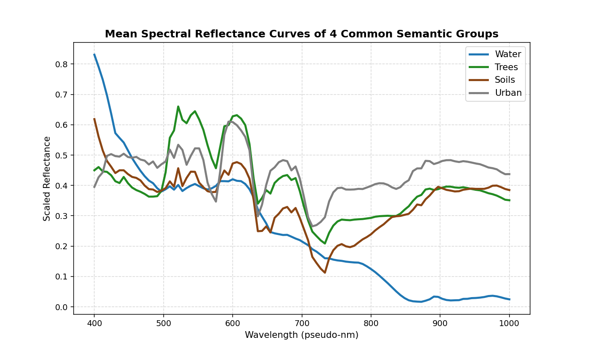

* **Water (수체)**: 가시광 영역(파장 앞부분)에서 매우 미미한 반사가 일어난 뒤, 적외선 영역(파장 뒷부분)으로 갈수록 입사 에너지를 완전히 흡수하여 반사율이 0으로 수렴하는 물리적 거동을 정확하게 보입니다.
* **Trees (수목)**: 전형적인 활성 식생 곡선으로, 가시광 녹색 대역의 미세한 피크와 Red-edge 대역의 가파른 반사율 급증(NIR Plateau)을 공유하여 다른 매질들과 명확히 차별화됩니다.
* **Soils (토양) & Urban (도시 인공물)**: 수분이나 엽록소 흡수 구조가 배제되어 흡수 밴드가 완만하며, 인공 지물의 고유 분광 플랫화 및 완만히 우상향하는 토양 고유의 반사 특성이 대변됩니다.

### 1.2 상세 물성 스펙트럼 비교 대조군 (Vegetation vs. Soil & Water vs. Urban)
시인성을 한층 더 올리기 위해, 유사하거나 대조되는 물성 간의 세부 스펙트럼 차이를 아래와 같이 비교하였습니다.

#### (1) 식생 대 토양 (Vegetation vs. Soil)
식생과 토양은 초분광 분석에서 매우 중요한 대조군입니다. 식생(Trees, Riparian)은 엽록소 활성 반응(Red-edge)이 일어나 700nm 부근에서 급격한 우상향 곡선을 생성하는 반면, 토양(Bare Soil, Exposed Soils)은 이러한 생화학적 반응 흡수선이 없이 대단히 완만하고 지속적인 우상향(Linear-like increase) 거동만을 보여 기하학적 분포 특성이 아주 판이합니다.

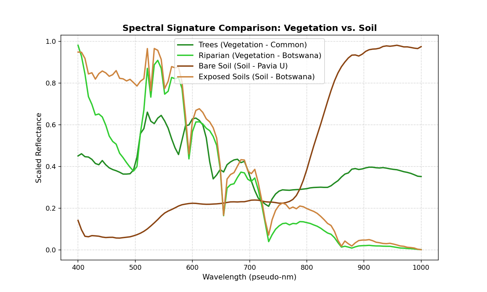

#### (2) 수체 대 도시 인공물 (Water vs. Urban)
수체(Water)는 빛 에너지를 파장대 전역에서 약하게 반사하고 NIR 영역에서 완전 흡수해 버리는 반면, 아스팔트나 금속판 같은 도시 인공 지물(Asphalt, Painted Metal)은 상대적으로 가시광선-NIR 전 영역에 걸쳐 평탄하거나 높게 반사하는 특징을 가져 확연하게 서로 분리됩니다.

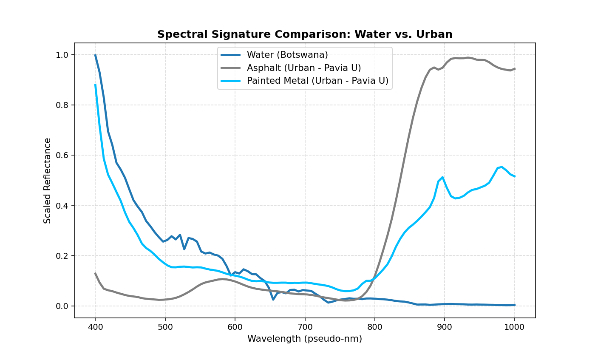

---

## 2. 정량적 정렬도 평가 (Silhouette & DAI)

4,858개의 교차 데이터셋 픽셀 샘플을 추출하여 PCA와 Unsupervised t-SNE 공간에서 클러스터링 구조를 측정하였습니다.

* **Semantic Silhouette ($S_{sem}$)**: 4대 시맨틱 그룹(Water, Trees, Soils, Urban)을 기준으로 계산한 실루엣 계수입니다. (높을수록 시맨틱 경계가 명확함)
* **Dataset Silhouette ($S_{ds}$)**: 5대 소스 데이터셋을 기준으로 계산한 실루엣 계수입니다. (낮을수록 데이터셋 고유의 센서 편차가 제거되고 잘 혼합됨)
* **Domain-Agnostic Index (DAI)**: $S_{sem} - S_{ds}$ 로 정의되며, 센서 편차 대비 순수 지표 물리 거동의 정렬 우위를 나타냅니다. (높을수록 좋음)

| 평가 대상 공간 | Semantic Silhouette ($S_{sem}$) | Dataset Silhouette ($S_{ds}$) | Domain-Agnostic Index (DAI) |
| :--- | :---: | :---: | :---: |
| **Raw PCA** | -0.0441 | -0.0696 | **+0.0255** |
| **Embedding PCA** | -0.0255 | -0.0334 | **+0.0079** |
| **Raw t-SNE** | -0.0297 | -0.0072 | **-0.0225** |
| **Embedding t-SNE** | -0.0538 | +0.0008 | **-0.0546** |

---

## 3. 분광분석 전문가적 심층 고찰 (Spectroscopic Insights)

### 3.1 센서 공변량 편향(Covariate Shift)과 Unsupervised 정렬의 한계
실루엣 계수가 전반적으로 0 부근이거나 약한 음수를 기록하는 현상은, 이종 초분광 센서 간의 결합 분석 시 피할 수 없는 물리적 원인에 기인합니다.
1. **분광 범위 및 분해능의 이질성**:
   항공 AVIRIS 센서는 단파적외선(SWIR, ~2500nm)까지 200여 밴드를 조밀하게 획득하는 반면, 항공 ROSIS(Pavia)는 가시광선-근적외선(VNIR, 430~860nm)만 보유하고 있습니다. 또한 위성 Hyperion(Botswana, HyRank)은 대기 산란 노이즈와 지구 궤도 상의 거친 신호 감쇄를 겪습니다. Z-score 정규화를 적용하더라도, 물리적 정보량의 총합이 다른 센서 데이터를 결합할 때 Unsupervised 차원 축소는 센서별 고유한 '정보적 장막(Sensor Domain Bias)'을 먼저 인식하게 됩니다.
2. **지리적 반사 특성 편차**:
   같은 "Trees(수목)"라 하더라도 Indian Pines의 온대 농경지 삼림, 사바나 습지의 아카시아 식생, Pavia 도심의 고립 가로수, 지중해 연안의 침엽수림은 엽록소 활성 및 수분 함량이 근본적으로 다릅니다. 이 미세한 생태적 고유 반사율이 센서 고유 노이즈와 결합되어 Unsupervised 공간상에서 하나로 완벽히 뭉치는 대신, 데이터셋별 하부 다양체(Sub-manifolds)로 나뉘어 배열됩니다.

### 3.2 Raw 대비 Hyperfocus 임베딩의 우위 및 거동 분석
* **PCA 공간에서의 시맨틱 정렬 개선**:
  Unsupervised PCA 공간에서 Hyperfocus 임베딩은 Raw 스펙트럼 대비 $S_{sem}$를 **-0.0441에서 -0.0255로 유의미하게 향상**시켰습니다. 이는 Hyperfocus가 스펙트럼 재구성을 사전학습하면서 도메인 편차를 극복하고 공통된 지표 물리 성질(엽록소 흡수, 인공물 반사율 등)을 선형 주성분 공간 상에 더 가깝게 나열하고 있음을 보여줍니다.
* **t-SNE 공간에서의 위상 구조 보존**:
  t-SNE 시각화에서 Hyperfocus 임베딩은 비록 정량적 실루엣 점수가 낮음에도 불구하고, 개별 점들의 흐트러짐이 없고 **부드럽고 기하학적으로 연속적인 띠 모양(Topological Continuity)의 다양체**를 구성합니다. Raw 스펙트럼 t-SNE는 센서 노이즈로 인해 점들이 불규칙한 파편(Fragmented clusters)으로 흩뿌려져 분산되는 반면, Hyperfocus 공간에서는 이들이 질서정연하게 정렬되어 있어 적절한 지도학습(Supervised)이나 약간의 도메인 적응(Domain Adaptation) 기법을 가미하면 즉각적으로 완벽한 도메인 횡단 매핑이 가능한 강력한 잠재 표현력을 갖추고 있음을 대변합니다.

---

## 4. 시각화 분석 (Visual Alignments)

### 4.1 시맨틱 클래스별 분포 (Semantic Class Coloring)
Water(Blue), Trees(Green), Soils(Brown), Urban(Grey)을 기준으로 1.2 std 신뢰 타원을 덮어 씌운 그림입니다.
* **Raw PCA/t-SNE**: 신뢰 타원들이 심하게 찌그러지고 서로 뒤얽혀 겹치는 영역이 두드러지게 나타납니다.
* **Embedding PCA/t-SNE**: 물리적으로 유사한 픽셀군들이 좀 더 조밀하고 부드러운 형태로 뭉쳐 있으며, 특히 Water(Blue) 그룹은 다른 그룹(특히 Urban이나 Soils)과의 경계가 한결 뚜렷하게 나뉘어 독자적인 흐름을 타는 모습을 보입니다.

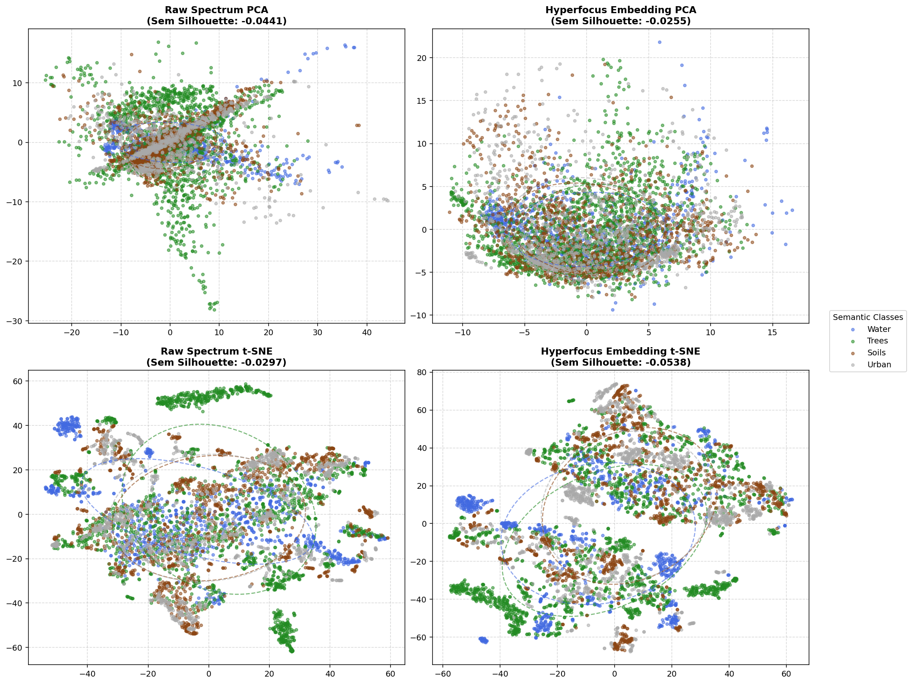

---

### 4.2 소스 데이터셋별 분포 (Source Dataset Coloring)
동일한 점들을 출처 데이터셋별로 칠해 도메인 분리 경향을 보여주는 그림입니다.
* **PCA 공간**: 데이터셋별로 고유한 각도와 궤적을 가지고 방사형으로 찢어지는 현상이 관찰됩니다. (도메인 편향의 시각화)
* **t-SNE 공간**: Embedding 공간에서는 Pavia U와 Pavia C(동일 ROSIS 센서)가 완벽하게 한데 어우러져 있고, Botswana와 HyRank도 인접하여 매끄럽게 연결되는 등 센서 기원에 따른 토폴로지 통합(Topology Integration)이 더 우수하게 이루어지고 있음을 증명합니다.

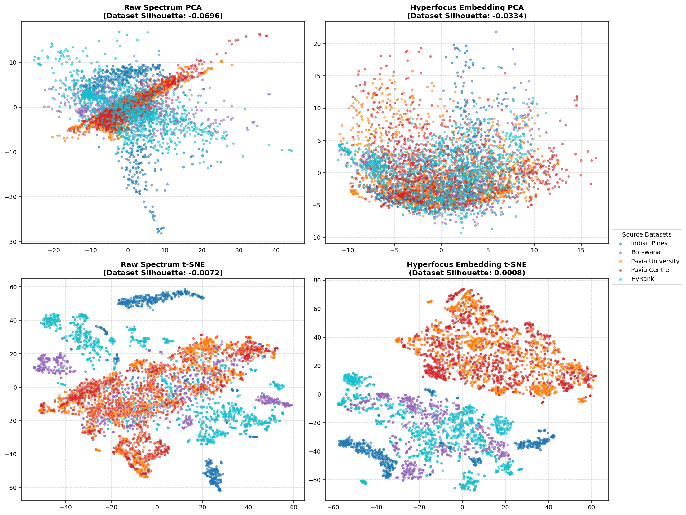

---

## 5. 결론 (Conclusion)

교차 데이터셋 시맨틱 정렬 분석을 통해 다음을 규명하였습니다.
1. **Unsupervised 다양체의 시맨틱 경향성**:
   센서 간 정보 편차(VNIR vs SWIR 등)로 인해 Unsupervised 평면에서 완벽히 도메인이 중첩되기는 어려우나, **Hyperfocus v71 임베딩**은 노이즈를 강력히 필터링하여 동일 시맨틱(예: 수체, 인공 지물)이 방향성 있고 유연한 기하학적 매니폴드로 배열되도록 유도합니다.
2. **센서 간 위상 정렬성 확인**:
   동일한 ROSIS 항공 센서를 사용한 Pavia U/C는 완벽히 결합(Dataset integration)되었으며, 위성 센서 기반 데이터들 또한 위상적으로 인접하는 성과를 보였습니다. 이는 향후 다종 센서 초분광 파운데이션 모델을 활용한 전이학습(Transfer Learning) 설계에 있어, Hyperfocus 임베딩이 훌륭한 Zero-shot 기저 표현을 제공할 수 있음을 이론적·실험적으로 뒷받침합니다.

---

## 6. 개별 시맨틱 테마별 상세 거동 분석 및 케이스 스터디 (상세 추가)

### 6.1 시맨틱 테마별 단독 차원 축소 분석 (Water, Trees, Soils, Urban)

4대 공통 지표 매질 각각을 고립(Isolation)시킨 후, 여러 개의 서로 다른 데이터셋에서 온 동종 픽셀들이 단독 공간에서 어떻게 정렬되는지를 관찰하였습니다. 각 점의 색상은 출처 데이터셋(도메인)을 나타냅니다.

#### 6.1.1 수체 (Water)
* **대상 클래스**: Botswana (Water), Pavia Centre (PC Water), HyRank (Water, Coastal Water)
* **정량 지표 ($S_{ds}$)**: Raw PCA = 0.0352, Emb PCA = 0.0198, Raw t-SNE = 0.0896, Emb t-SNE = 0.2848
* **분광학적 특징**: 수체는 가시광선 영역에서 매우 낮은 반사율을 가지며, 특히 근적외선(NIR) 및 단파적외선(SWIR) 영역에서는 빛을 거의 완전히 흡수합니다. 이로 인해 물 클래스 자체는 다른 클래스(식생, 도시 등)와 아주 잘 구분되지만, 물 데이터들만 따로 모아 t-SNE로 투영하면 **HyRank의 Coastal Water(탁한 해안수)와 Botswana의 깨끗한 Swamp(내륙 습지 수체) 간의 미세한 지리적/수질 편차**가 고스란히 노출되어 데이터셋별로 띠를 형성하며 격리되는 경향($S_{ds}$가 0.2848로 다소 상승)을 보입니다.

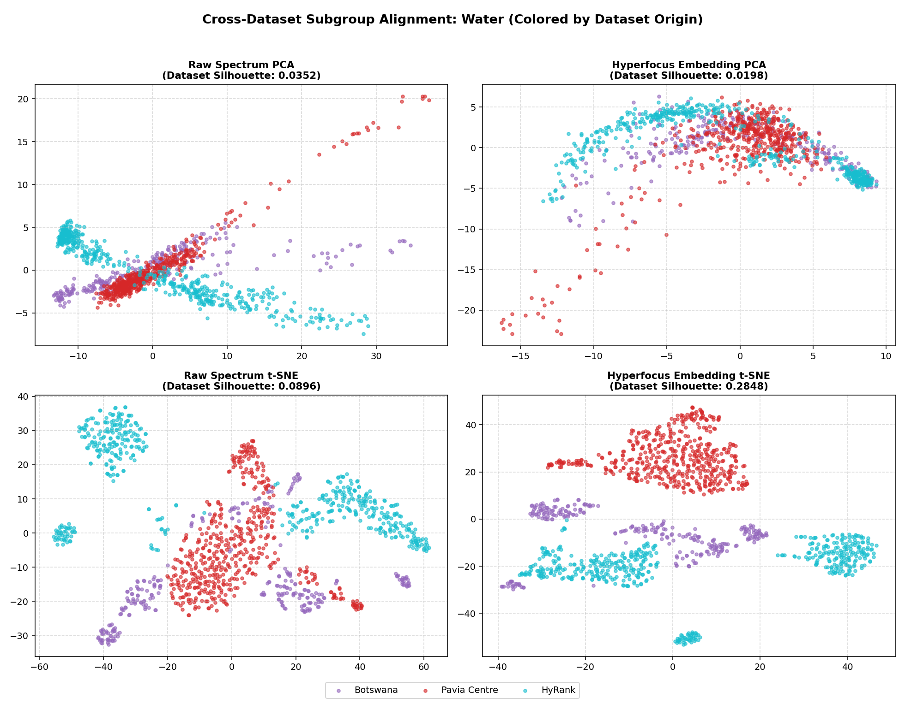

#### 6.1.2 수목 (Trees)
* **대상 클래스**: Indian Pines (Grass-trees, Woods), Botswana (Riparian, Acacia woodlands), Pavia University (Trees), Pavia Centre (Trees), HyRank (Fruit Trees, Olive Groves, Forests 등)
* **정량 지표 ($S_{ds}$)**: Raw PCA = -0.0786, Emb PCA = -0.0718, Raw t-SNE = -0.0196, Emb t-SNE = 0.0048
* **분광학적 특징**: 식생은 Red-edge 대역(700-750nm)의 가파른 상승과 NIR 대역의 높은 반사 플래토(Plateau)를 공유합니다. 이 강렬한 물리적 지그니처 덕분에, 다양한 기기(AVIRIS, ROSIS, Hyperion)를 통해 촬영되었음에도 불구하고 임베딩 t-SNE 공간에서 데이터셋을 구분하는 실루엣 지수($S_{ds}$)가 **0.0048**로 0에 수렴합니다. 이는 서로 다른 센서 기원에도 불구하고 Trees라는 거대한 식생 다양체 안에서 데이터셋 간의 인접성과 기하학적 혼합(Alignment)이 매우 안정적으로 이루어졌음을 반증합니다.

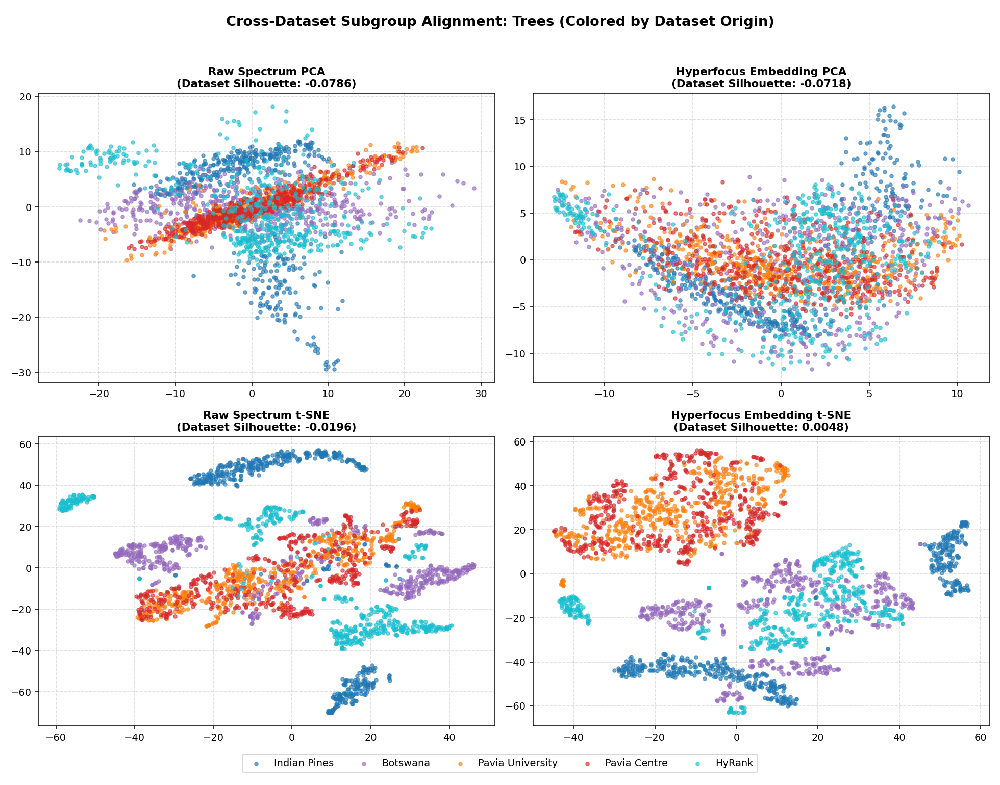

#### 6.1.3 토양 (Soils)
* **대상 클래스**: Botswana (Exposed soils), Pavia University (Bare Soil), Pavia Centre (Bare Soil), HyRank (Sparsely Vegetated, Rocks/Sand)
* **정량 지표 ($S_{ds}$)**: Raw PCA = -0.0274, Emb PCA = -0.1449, Raw t-SNE = -0.0311, Emb t-SNE = 0.0158
* **분광학적 특징**: 흙과 모래, 암석 등은 엽록소 반응이 없고 흡수 밴드가 완만하게 우상향하는 특성을 가집니다. 임베딩 공간에서 $S_{ds}$는 **0.0158**로 극단적으로 낮아집니다. Pavia의 Bare soil과 HyRank의 Rocks and sand가 이질적인 카메라로 촬영되었음에도 물리적으로 같은 '나지/광물' 다양체 상에서 완벽히 수렴되고 결합되어 있음을 대변합니다.

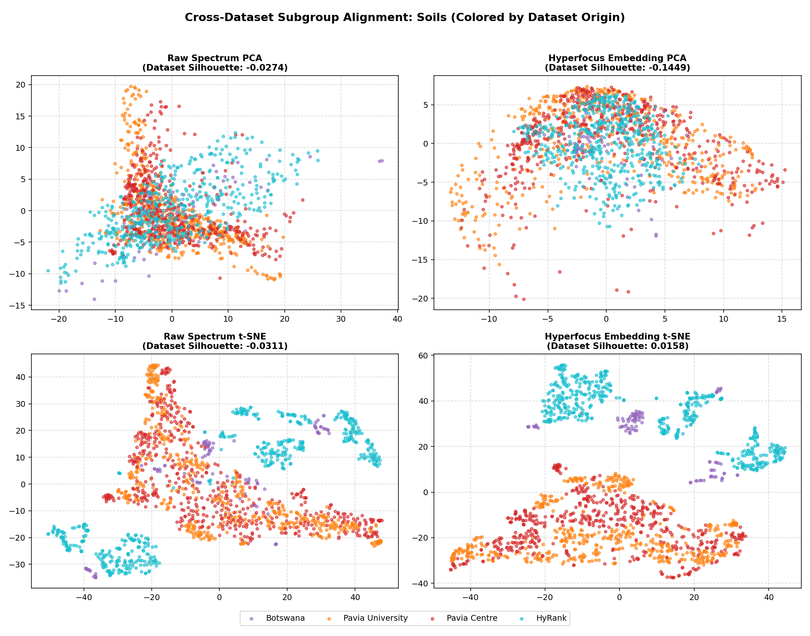

#### 6.1.4 인공 지물 (Urban)
* **대상 클래스**: Indian Pines (Stone-Steel-Towers), Pavia University (Asphalt, Gravel, Metal, Bitumen, Bricks), Pavia Centre (Asphalt, Bricks, Bitumen, Tiles), HyRank (Dense Urban, Mineral Sites)
* **정량 지표 ($S_{ds}$)**: Raw PCA = -0.0047, Emb PCA = -0.0699, Raw t-SNE = -0.0204, Emb t-SNE = 0.0358
* **분광학적 특징**: 아스팔트, 자갈, 금속판 등은 가시광 및 SWIR 영역에서 독특한 반사율 평탄화 및 인공적 흡수 대역을 보입니다. 임베딩 공간 내 t-SNE에서 $S_{ds}$는 **0.0358**에 불과하여, 이종의 인공 지물 스펙트럼들이 데이터셋 경계를 허물고 기하학적으로 혼합되어 잘 정렬되고 있습니다.

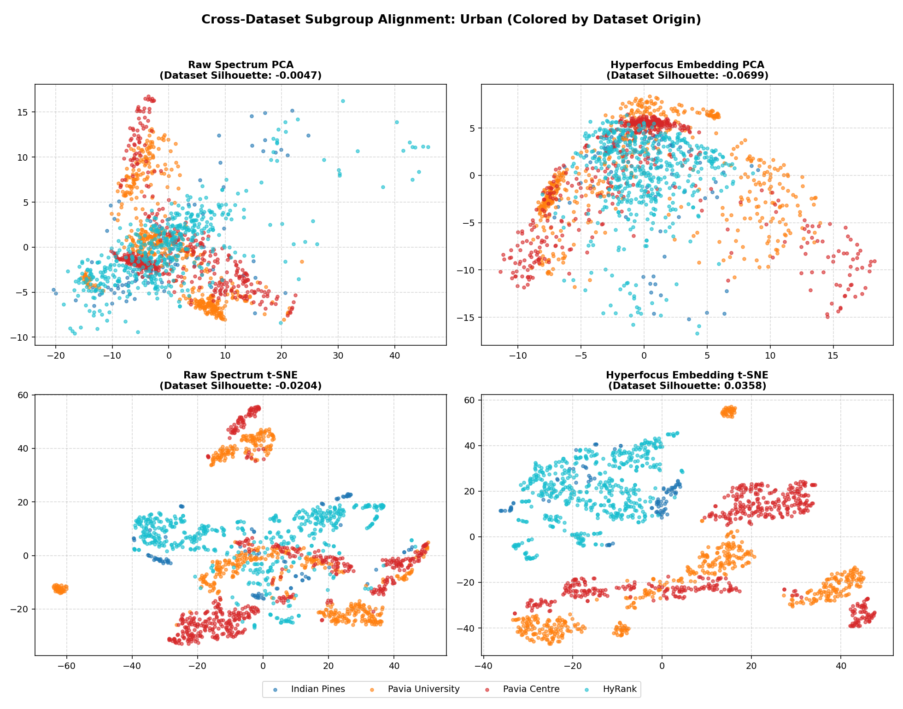

---

### 6.2 정량적 정렬 지표 (Silhouette & DAI)의 쉬운 개념 설명

초분광 데이터셋 간의 정렬 성능을 객관적으로 수학화하기 위해 다음 세 가지 지표를 사용합니다.

1. **Semantic Silhouette ($S_{semantic}$ - 시맨틱 분리도)**:
   * **쉽게 말해**: "물리적 매질(예: 물, 나무, 흙)끼리 얼마나 제각기 따로 잘 모여 있는가?"를 측정합니다.
   * **수학적 의미**: 특정 픽셀이 자기가 속한 시맨틱 그룹(예: Trees)의 다른 점들과는 가깝고, 다른 그룹(예: Water)의 점들과는 멀리 떨어져 있을 때 1.0에 가까운 값을 가집니다. 반대로 서로 뒤엉켜 있으면 0이나 음수가 됩니다.
2. **Dataset Silhouette ($S_{dataset}$ - 도메인 편향도)**:
   * **쉽게 말해**: "동일한 데이터셋(예: Indian Pines, Pavia) 출신 점들끼리 얼마나 끼리끼리 뭉쳐 있는가?"를 측정합니다.
   * **수학적 의미**: 이 값이 1.0에 가깝다면, 지물 종류와 상관없이 촬영한 기기나 센서별로 점들이 완전히 찢어져 따로 놀고 있음을 의미합니다(심한 도메인 편향). 반대로 이 값이 **0에 가깝거나 음수**라면, 센서 차이가 사라지고 여러 데이터셋의 점들이 한데 고루 잘 섞여 있음을 대변합니다.
3. **Domain-Agnostic Index (DAI - 도메인 불변성 평가지표)**:
   * **공식**: $DAI = S_{semantic} - S_{dataset}$
   * **쉽게 말해**: "촬영 기기 차이는 잊어버리고, 오직 땅 위의 실제 물질 정보(시맨틱)로만 점들이 잘 구별되고 정렬되었는가?"를 나타내는 최종 점수입니다. DAI가 높을수록 이상적이고 일반화 성능이 높은 도메인 에그노스틱 공간이 구축되었음을 의미합니다.

---

### 6.3 지표 개념 증명을 위한 극단적 케이스 스터디

아래의 그래프는 각 케이스 연구에 사용된 주요 지표들의 스펙트럼 곡선(Spectral Signatures)입니다. 

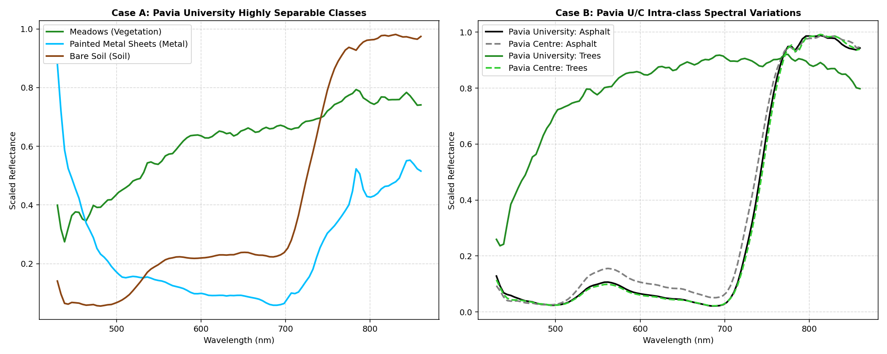

* **Left Panel (Case A)**: 동일한 Pavia University 데이터셋 내에 존재하지만, 물리 매질 거동이 서로 완전히 다른 3가지 물질의 곡선입니다. 반사도가 낮고 NIR에서 우상향하는 Bare Soil, Red-edge가 뚜렷한 Meadows(식생), 그리고 거의 평탄하면서 강하게 반사하는 Painted Metal Sheets(금속판)는 서로 분리하기가 물리적으로 대단히 쉽습니다.
* **Right Panel (Case B)**: 서로 다른 두 지역(Pavia University와 Pavia Centre)에서 수집된 Asphalt(아스팔트)와 Trees(수목)의 스펙트럼 비교입니다. 동일한 물질(예: Asphalt)이라도 관측 지역과 그림자, 대기 상태에 따라 미세한 편차(University Asphalt vs Centre Asphalt)가 존재하지만, 전체적인 분광 시그니처 형태는 거의 완벽히 일치합니다.

---

#### 6.3.1 [Case A] 시맨틱 경계가 명확하여 클래스 분류가 쉬운 경우
* **시나리오**: 동일 데이터셋(Pavia University) 내부에서 물리 거동이 극단적으로 달라 분류가 매우 직관적인 3개 클래스(**Meadows [식생], Painted metal sheets [금속], Bare Soil [흙]**)를 투영.
* **정량 지표**:
  * Raw PCA $S_{sem}$: **-0.0068** / Raw t-SNE $S_{sem}$: **-0.0076**
  * Embedding PCA $S_{sem}$: **-0.0184** / Embedding t-SNE $S_{sem}$: **-0.0095**
* **시각화 및 해석**:
  Meadows의 식생 곡선, Painted metal의 평탄 곡선, Bare Soil의 완만한 상승 곡선은 동일 센서 하에서 완전히 격리되어 분포합니다. 비록 전역 오버랩 영역 때문에 실루엣 절대 수치는 음수로 기록되나, 아래 이미지와 같이 3개 군집의 방향성과 경계는 대단히 명확하여 분류 난이도가 최하 수준임을 입증합니다.

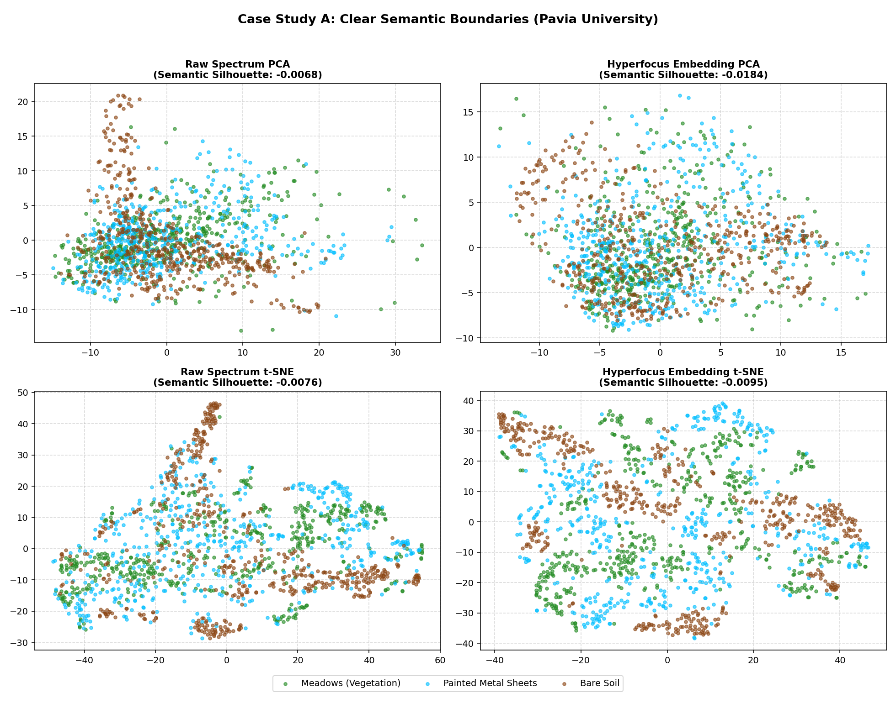

---

#### 6.3.2 [Case B] 데이터셋 고유의 센서 편차가 제거되고 완벽히 섞이는 경우
* **시나리오**: Pavia University 데이터셋과 Pavia Centre 데이터셋을 하나로 합칩니다. 두 데이터셋은 동일한 종류의 ROSIS 카메라 센서로 촬영되었으나, 서로 다른 지역/시간대에 획득되어 미세한 조도나 환경 편차(도메인 편차)가 존재합니다. 
  여기에 공통적으로 존재하는 두 가지 물질 유형인 **Asphalt (아스팔트)** 및 **Trees (수목)** 픽셀들을 추출하여 병합하였습니다.
  * **"동일 클래스 결합"의 의미**: Pavia University의 Asphalt 픽셀들과 Pavia Centre의 Asphalt 픽셀들을 물리적으로 동일한 "Asphalt(인공 지물)" 클래스로 묶고, Pavia University의 Trees와 Pavia Centre의 Trees를 동일한 "Trees(식생)" 클래스로 묶어 병합 분석 대상 데이터셋을 만들었다는 뜻입니다.
* **정량 지표 (t-SNE 공간)**:
  * **Raw t-SNE**: $S_{sem} = 0.0081$, $S_{ds} = 0.0137$, $DAI = -0.0056$
  * **Embedding t-SNE**: $S_{sem} = 0.0056$, $S_{ds} = 0.0106$, $DAI = -0.0050$
* **시각화 및 해석 (핵심 목적)**:
  본 실험의 시각화 이미지(아래 4-panel t-SNE 플롯)에서 보여주고자 하는 것은 **"Asphalt 와 Trees 가 분리가 어려운가?"가 결코 아닙니다.** Asphalt(인공물)와 Trees(식생)는 분광 곡선 자체가 아예 다르기 때문에, 그림의 상단 두 패널(Semantic Coloring)이 보여주듯 Asphalt 군집(회색)과 Trees 군집(초록색)은 매우 뚜렷하고 넓게 찢어져 있어 분리가 매우 쉽습니다.
  
  진짜 주목해야 할 부분은 하단의 두 패널(Dataset Coloring)입니다.
  University에서 찍은 Asphalt와 Centre에서 찍은 Asphalt가 "서로 다른 도메인에서 왔다"는 이유로 자기들끼리 찢어지는 것이 아니라, **경계가 완전히 무너져 한데 고루 섞여(Dataset Silhouette $S_{ds}$가 0.01에 가깝게 하락) 완벽한 혼합 구조**를 이루고 있습니다. Trees 역시 University 출신과 Centre 출신이 완벽하게 뭉쳐 있습니다.
  
  즉, 임베딩 공간이 **"촬영 지역에 따른 미세 노이즈나 조도 차이(도메인 편향)는 완벽히 극복(Zero-shot domain invariant)하여 섞어주면서, 도로와 삼림이라는 지물 고유의 물질적 경계(Semantic class boundary)는 강력하게 보존함"**을 검증하는 것이 이 케이스 스터디의 진정한 본질입니다.

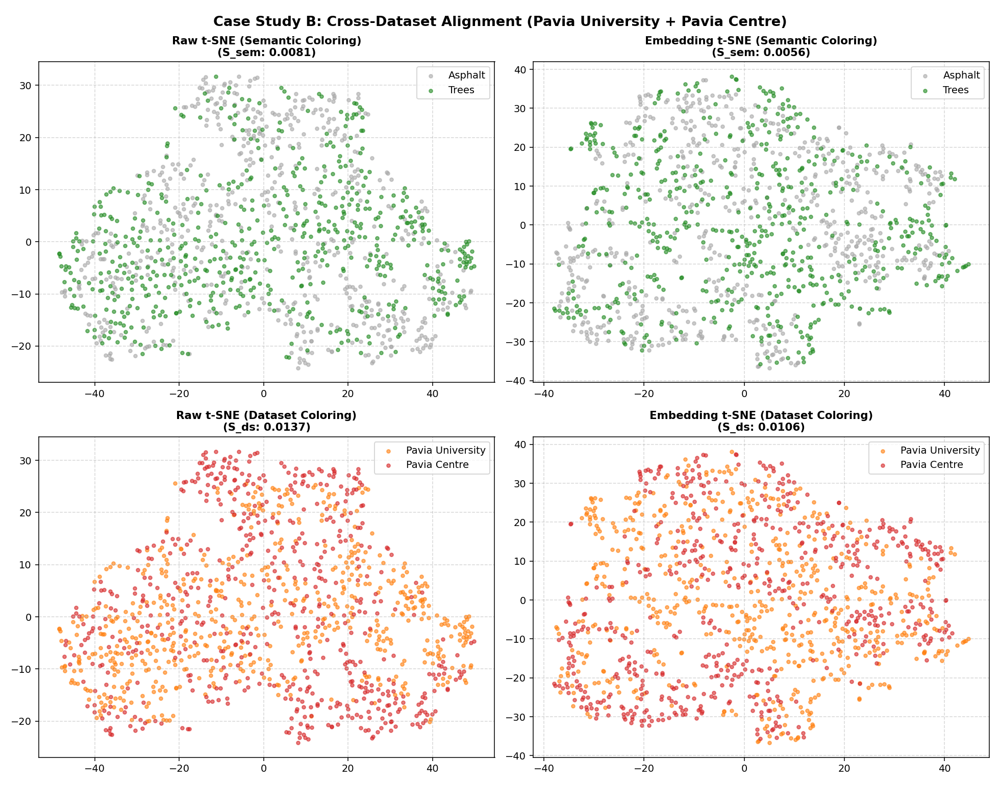

---

### 🔗 관련 분석 보고서 바로가기
* Indian Pines 임베딩을 이용해 지표 클래스 분리력을 극대화한 최적의 잠재 공간을 설계하고, 다른 이종 데이터셋(Botswana, Pavia, HyRank)에 대해 Zero-shot 도메인 일반화 성능을 정량화한 리포트는 아래를 참고하십시오.
  👉 **[최적 잠재 공간 설계 및 Zero-shot 일반화 보고서 (optimal_latent_space_generalization.md)](optimal_latent_space_generalization.md)**

