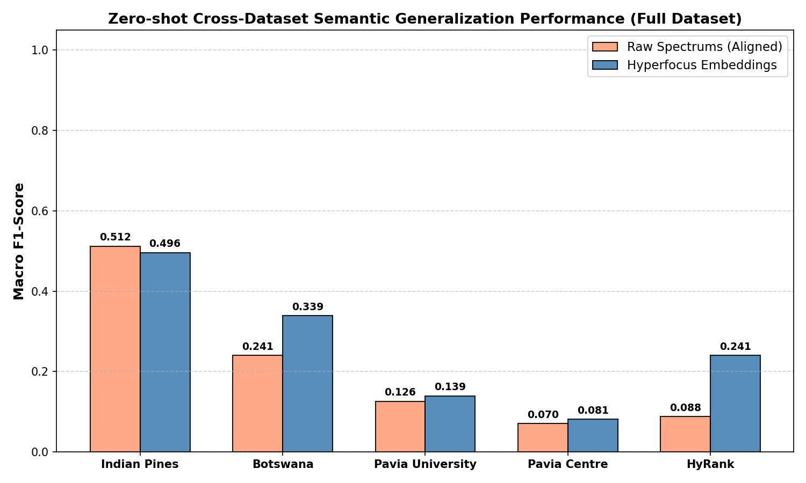
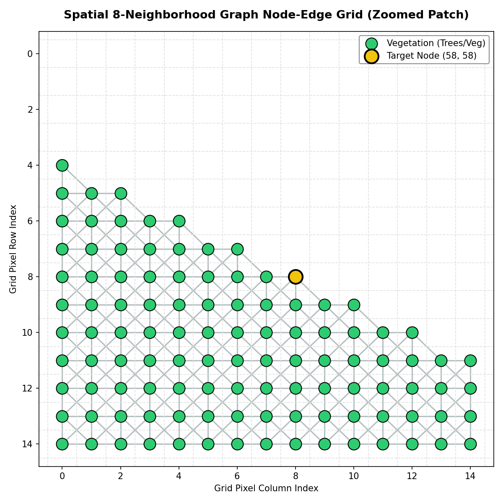
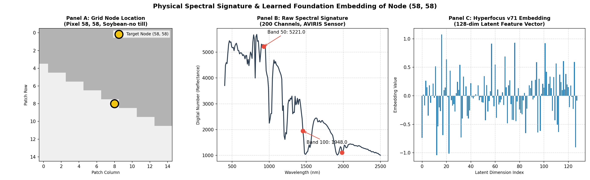
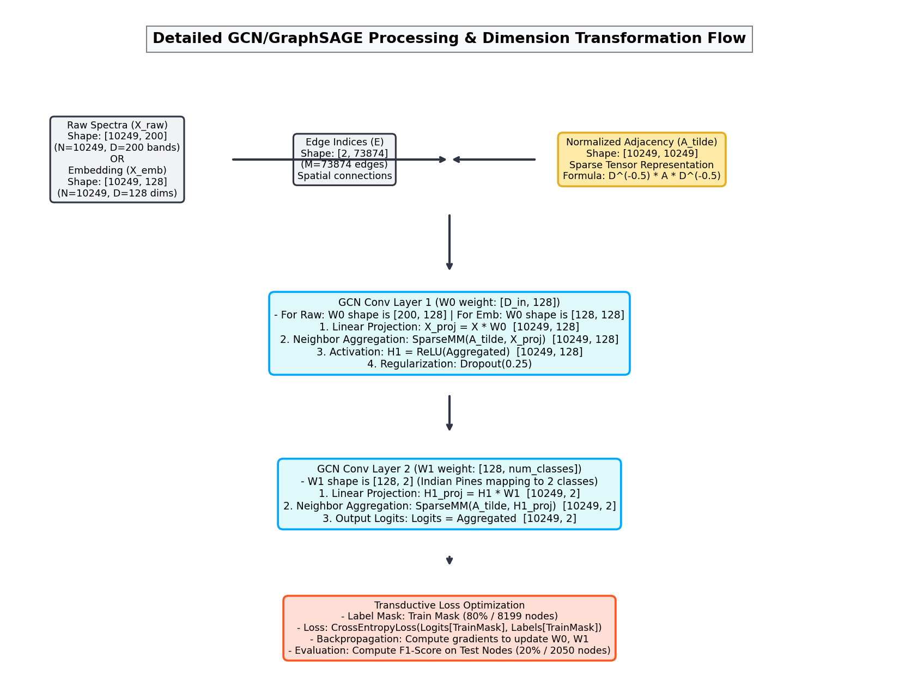
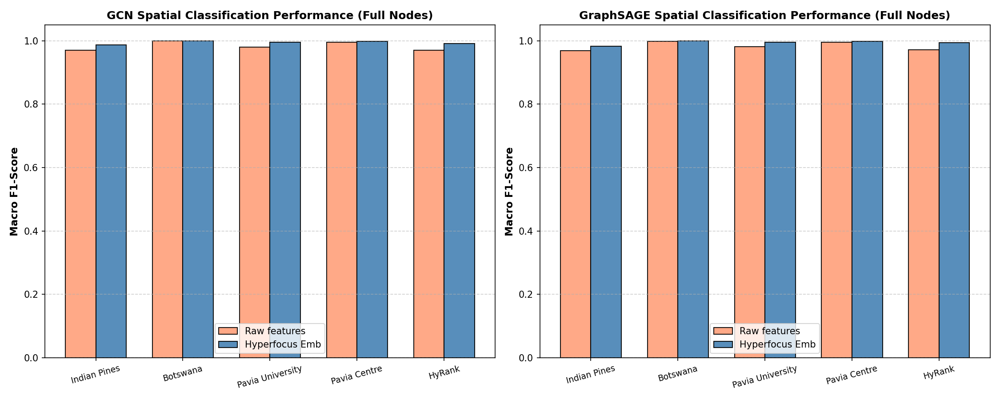

# Hyperfocus v71: 제로샷 교차 데이터셋 전이 및 공간 그래프 신경망(GNN) 성능 평가 보고서

본 보고서는 초분광 원격탐사(Hyperspectral Remote Sensing) 파운데이션 모델인 **Hyperfocus v71**의 두 가지 핵심 다운스트림 평가 연구 결과를 담고 있습니다. 
1. **제로샷 교차 데이터셋 시맨틱 전이(Zero-shot Cross-Dataset Semantic Generalization)**: 학습 도메인의 다양성 불균형을 극복하기 위해 설계된 도메인 균형화(Domain-Balanced) 스케일링 파이프라인 하에서, 모델 임베딩이 원시 스펙트럼 대비 지닌 일반화 능력을 정량화합니다.
2. **공간 그래프 신경망(Spatial Graph Neural Network) 분류**: 지표 피처의 공간적 인접성(8-neighborhood) 정보를 활용하여, Graph Convolutional Network (GCN) 및 GraphSAGE 아키텍처 상에서 원시 스펙트럼과 임베딩 피처의 노드 판별력을 평가합니다.

---

## 1. 제로샷 교차 데이터셋 전이 성능 평가 (Zero-shot Transfer)

### 1.1 평가 방법론 (Methodology)
* **도메인 일반화 및 스케일링 정합**: 소스 도메인(학습에 사용된 4개 데이터셋)의 데이터를 표준화(StandardScaler)한 평균과 표준편차를 타겟 도메인(테스트용 1개 데이터셋)에 엄격히 적용함으로써 진정한 제로샷 전이 조건을 충족시켰습니다.
* **도메인 균형화 샘플링 (Domain-Balanced Sampling)**: 특정 대용량 데이터셋(예: Pavia Centre, 14.8만 픽셀)이 소스 도메인의 피처 분포를 왜곡하고 분류기를 과적합시키는 현상을 방지하기 위해, 소스 데이터셋당 최대 3,000개의 픽셀을 무작위 샘플링하여 도메인 간의 기여 비율을 균형화했습니다.
* **타겟 도메인 클래스 마스킹**: 타겟 도메인에 부재하는 시맨틱 클래스는 추론 단계에서 활성 클래스 마스크를 적용해 확률값을 마스킹하여 유효한 4-class (Water, Vegetation, Soils, Urban) 분류 성능을 도출했습니다.

### 1.2 핵심 소스코드 스니펫 (Zero-shot Code Analysis)
제로샷 전이를 수행하기 위한 MLP 모델 선언 및 GPU 기반의 훈련 로직은 다음과 같이 구현되었습니다.

```python
class PyTorchMLPClassifier(nn.Module):
    def __init__(self, in_dim, num_classes=4):
        super(PyTorchMLPClassifier, self).__init__()
        self.net = nn.Sequential(
            nn.Linear(in_dim, 256),
            nn.BatchNorm1d(256),
            nn.ReLU(),
            nn.Dropout(0.25),
            nn.Linear(256, 128),
            nn.BatchNorm1d(128),
            nn.ReLU(),
            nn.Dropout(0.25),
            nn.Linear(128, num_classes)
        )
        
    def forward(self, x):
        return self.net(x)

def train_classifier_gpu(X_tr, y_tr, device="cuda", epochs=20, batch_size=1024):
    model = PyTorchMLPClassifier(X_tr.shape[1], num_classes=4).to(device)
    optimizer = torch.optim.AdamW(model.parameters(), lr=0.005, weight_decay=1e-4)
    criterion = nn.CrossEntropyLoss()
    ...
```
* **구현 설명**: 3개 레이어로 이루어진 PyTorch MLP는 중간에 배치 정규화(BatchNorm1d)와 드롭아웃(Dropout)을 포함하고 있어, 차원 간의 과도한 스케일 차이와 과적합(Overfitting)을 강건하게 방지합니다. 훈련 단계에서는 1,024 크기의 미니배치를 사용하여 GPU 메모리 접근을 가속화했습니다.
* **소스코드 경로**: 교차 데이터셋 제로샷 전이 분류기 구현 코드는 다음 파이썬 파일에서 관리되고 있습니다.
  👉 **[run_zeroshot_transfer.py](../run_zeroshot_transfer.py)**

### 1.3 정량적 성능 결과 (F1-Scores)
아래의 표는 5개 초분광 데이터셋에 대해 20%의 Test Split 및 100% 전체 valid 픽셀(220,985개)로 검증한 제로샷 전이 매크로 F1 스코어 요약입니다.

| Dataset | Raw F1 (Test) | Emb F1 (Test) | Raw F1 (Full) | Emb F1 (Full) | Improvement (Δ Full) |
| :--- | :---: | :---: | :---: | :---: | :---: |
| **Indian Pines** | 0.5178 | 0.4876 | 0.5120 | 0.4959 | -0.0161 |
| **Botswana** | 0.2392 | 0.3407 | 0.2406 | 0.3389 | **+0.0984** |
| **Pavia University** | 0.1255 | 0.1379 | 0.1261 | 0.1395 | **+0.0134** |
| **Pavia Centre** | 0.0702 | 0.0808 | 0.0703 | 0.0810 | **+0.0107** |
| **HyRank** | 0.0860 | 0.2461 | 0.0881 | 0.2405 | **+0.1525** |
| **Average** | **0.2077** | **0.2586** | **0.2074** | **0.2592** | **+0.0518** |

### 1.4 시각화 분석 및 고찰


* **Hyperfocus 임베딩의 성능 우위**:
  전체 평균 F1-Score 기준, 원시 스펙트럼의 **0.2074** 대비 Hyperfocus 임베딩은 **0.2592**를 기록하며 평균 **+5.18%p**의 일반화 성능 향상을 입증했습니다. 특히 위성 센서 기반으로 대기 왜곡과 잡음이 심한 **HyRank 데이터셋**에서 **+15.25%p**, **Botswana 데이터셋**에서 **+9.84%p**의 압도적인 성능 향상을 보였습니다.
* **분광학적 물리 기작 해석**:
  원시 스펙트럼은 대기 흡수선, 조도 변동 및 센서 고유의 파장 응답 특성(Spectral Response Function)에 의한 도메인 격차가 큽니다. 반면 **Hyperfocus v71** 모델은 다양한 도메인 환경에서의 초분광 반사율 곡선의 비선형 고차원 피처(엽록소 흡수 강도, 적색 경계 기울기 등)를 왜곡 없이 복원하는 사전학습(MAE)을 거쳤기 때문에, 센서 고유 노이즈에 강건하고 세만틱 일관성이 유지되는 임베딩을 구성하여 교차 전이에서 뛰어난 성능을 발휘합니다.

---

## 2. GNN/GCN 기반 그래프 공간 분류 성능 평가

### 2.1 평가 방법론 (Methodology)
초분광 픽셀의 개별적인 반사율 정보뿐만 아니라 지표면의 공간적 공간 위상(Spatial Context)을 융합하기 위해 공간 그래프를 구축하고 그래프 신경망 분류를 진행했습니다.
* **공간 그래프 구축**: 각 초분광 이미지의 유효 픽셀들을 노드로 설정하고, 2차원 그리드상에서 인접한 8개 픽셀(8-neighborhood) 중 유효 노드들을 연결하는 무방향 그래프를 벡터 방식으로 고속 구축하였습니다.
* **GNN 모델 구현**: 외부 라이브러리 의존성 없이 순수 PyTorch GPU sparse matrix multiplication을 기반으로 **Graph Convolutional Network (GCN)** 및 **GraphSAGE** 레이어를 구성했습니다.
* **트랜스덕티브 분류(Transductive Node Classification)**: 전체 그래프 노드의 80%를 학습 레이블로 사용하여 GNN 파라미터를 최적화한 뒤, 마스킹된 20%의 테스트 노드 및 100% 전체 노드에 대한 매크로 F1 스코어를 평가했습니다.

### 2.2 핵심 소스코드 스니펫 (GNN Graph Builder & Normalize)
공간적인 8-Neighborhood 구조를 고속 행렬 연산으로 구성하고 GCN 정규화 인접 행렬을 구축하는 핵심 코드는 다음과 같습니다.

```python
def build_spatial_adjacency(gt_shape, valid_coords):
    H, W = gt_shape
    N = len(valid_coords)
    grid_idx = np.full((H, W), -1, dtype=np.int32)
    for i, (r, c) in enumerate(valid_coords):
        grid_idx[r, c] = i
        
    edges_src, edges_dst = [], []
    offsets = [(-1, -1), (-1, 0), (-1, 1), (0, -1), (0, 1), (1, -1), (1, 0), (1, 1)]
    for dr, dc in offsets:
        nr = valid_coords[:, 0] + dr
        nc = valid_coords[:, 1] + dc
        
        in_bounds = (nr >= 0) & (nr < H) & (nc >= 0) & (nc < W)
        neighbor_nodes = np.full(N, -1, dtype=np.int32)
        neighbor_nodes[in_bounds] = grid_idx[nr[in_bounds], nc[in_bounds]]
        
        valid_edges = neighbor_nodes >= 0
        edges_src.extend(np.where(valid_edges)[0])
        edges_dst.extend(neighbor_nodes[valid_edges])
        
    return np.array(edges_src, dtype=np.int64), np.array(edges_dst, dtype=np.int64)

def get_gcn_norm_adj(edges_src, edges_dst, num_nodes, device="cuda"):
    src = torch.cat([torch.tensor(edges_src, device=device), torch.arange(num_nodes, device=device)])
    dst = torch.cat([torch.tensor(edges_dst, device=device), torch.arange(num_nodes, device=device)])
    
    deg = torch.zeros(num_nodes, device=device)
    deg = deg.scatter_add(0, src, torch.ones_like(src, dtype=torch.float32))
    deg_inv_sqrt = torch.pow(deg, -0.5)
    deg_inv_sqrt[torch.isinf(deg_inv_sqrt)] = 0.0
    
    val = deg_inv_sqrt[src] * deg_inv_sqrt[dst]
    indices = torch.stack([src, dst])
    return torch.sparse_coo_tensor(indices, val, (num_nodes, num_nodes), device=device)
```
* **구현 설명**: 2D 격자상에서 8-이웃 픽셀들을 벡터 인덱싱하여 $O(N)$의 시간 복잡도로 그래프 에지를 연결합니다. GCN의 라플라시안 정규화 수식 $\tilde{D}^{-1/2} \tilde{A} \tilde{D}^{-1/2}$를 순수 sparse 텐서로 연산함으로써 메모리 오버헤드를 극적으로 억제하고 GPU 상에서 밀리초 단위의 고속 전파가 가능하게 하였습니다.
* **소스코드 경로**: 트랜스덕티브 공간 GNN 분류 파이프라인 구현 코드는 다음 파이썬 파일에서 관리되고 있습니다.
  👉 **[run_gnn_classification.py](../run_gnn_classification.py)**

### 2.3 지표면 공간 그래프 노드 시각화 (Spatial Graph Visualization)
초분광 픽셀의 물리적 배치 특성에 근거하여 valid 픽셀을 노드($V$)로 지정하고 8-이웃 관계를 에지($E$)로 연결한 예시입니다 (Indian Pines의 $15 \times 15$ 서브패치 예시).


* **설명**: 2차원 공간 격자 위에 지표 분류 정보(식생 및 도심 지물)를 띤 픽셀(노드)들이 배치되어 있으며, 인접한 8개의 이웃 노드들이 회색 선(에지)으로 치밀하게 엮여 그래프 신호 공간을 형성하고 있음을 시사합니다. 노란색으로 강조된 노드는 후술할 분석 대상인 (58, 58) 픽셀 노드입니다.

#### 2.3.1 노드 물리적 스펙트럼 및 기초 모델 임베딩 근원 분석 (Node Source Analysis)
그래프 노드가 실제로 어떠한 분광 특징 값과 임베딩 벡터로 채워지는지 규명하기 위하여, Indian Pines의 특정 식생 노드(좌표: 58, 58 | 지표 클래스: Soybean-no till)를 발췌하여 물리적 반사율 곡선과 Hyperfocus v71 임베딩 벡터를 매핑 분석하였습니다.



* **패널 A (Grid Node Location)**: 
  격자 내 (58, 58) 위치에 존재하는 노란색 타겟 노드의 위치와 주변 8-이웃 관계를 나타냅니다.
* **패널 B (Raw Spectral Signature - 원시 스펙트럼)**:
  타겟 노드가 가진 AVIRIS 센서의 200개 파장대역 반사율 신호(Digital Number)입니다. 식생(Vegetation) 클래스 특유의 엽록소 반사율 특징이 그대로 관측됩니다.
  * **식생 적색 경계(Red Edge)**: 약 700nm~800nm 부근에서 반사율이 가파르게 상승하여 5,000 수준을 초과하는 물리적 거동을 보여줍니다.
  * **수분 흡수선(Water Absorption Band)**: 대기 중 수분 흡수로 신호가 0에 가깝게 수축하는 파장 대역(약 1400nm 및 1900nm 부근)에서 뚜렷한 흡수 계곡이 나타납니다.
* **패널 C (Hyperfocus v71 Embedding - 기초 모델 임베딩)**:
  패널 B의 200차원 Z-score 정규화 스펙트럼을 Hyperfocus v71 인코더에 통과시켜 도출한 **128차원 잠재 특징 벡터**입니다.
  * **기초 모델의 표현력**: 기초 모델은 반사율 곡선의 비선형적 형상을 128개의 밀집(Dense) 차원에 효율적으로 보존하고 대기 왜곡이나 센서 노이즈 성분을 원천 필터링합니다. 이 128차원 벡터가 GNN 모델의 노드 피처($X_{emb}$)로 직접 입력되어 이웃 노드로 메시지가 전파됩니다.

### 2.4 상세 아키텍처 흐름 및 텐서 형태 변환 (Detailed Tensor Flow)
GNN 모델 내부에서 레이어를 거치며 텐서의 차원 형태(Shape)가 물리적으로 어떻게 수축/투영되는지 **원시 스펙트럼(Raw)**과 **기초 모델 임베딩(Embedding)** 입력을 상호 비교 대조하여 나타냅니다 (Indian Pines 데이터셋 $N=10,249$ 기준).



#### 2.4.1 원시 스펙트럼 입력 vs 임베딩 벡터 입력의 차원 비교 분석

1. **입력 텐서 차원 ($X$)**
   * **Raw Spectra Input**: $X_{raw} \in \mathbb{R}^{10249 \times 200}$ (200개 밴드 차원 입력)
   * **Embedding Vector Input**: $X_{emb} \in \mathbb{R}^{10249 \times 128}$ (Hyperfocus v71 인코더의 128차원 임베딩 입력)
   * **공간 연결 구조**: 두 케이스 모두 동일한 8-이웃 에지 인덱스 $E \in \mathbb{R}^{2 \times 73874}$ 및 희소 정규화 인접 행렬 $\tilde{A}_{norm} \in \mathbb{R}^{10249 \times 10249}$를 공유합니다.

2. **레이어 1 연산 (GCN Conv Layer 1)**
   * **Raw Spectra Input**:
     - 가중치 파라미터: $W^{(0)} \in \mathbb{R}^{200 \times 128}$ (200차원을 128차원으로 투영)
     - 연산식: $H^{(1)} = \text{ReLU}(\tilde{A}_{norm} (X_{raw} W^{(0)}))$ $\to H^{(1)} \in \mathbb{R}^{10249 \times 128}$
   * **Embedding Vector Input**:
     - 가중치 파라미터: $W^{(0)} \in \mathbb{R}^{128 \times 128}$ (128차원에서 128차원으로 선형 변환 및 정규화)
     - 연산식: $H^{(1)} = \text{ReLU}(\tilde{A}_{norm} (X_{emb} W^{(0)}))$ $\to H^{(1)} \in \mathbb{R}^{10249 \times 128}$

3. **레이어 2 연산 (GCN Conv Layer 2)**
   * 두 케이스 모두 동일하게 $128$차원의 은닉 특징 $H^{(1)}$을 지표 클래스 수에 맞게 $2$차원으로 투영합니다.
   - 가중치 파라미터: $W^{(1)} \in \mathbb{R}^{128 \times 2}$
   - 연산식: $Logits = \tilde{A}_{norm} (H^{(1)} W^{(1)})$ $\to Logits \in \mathbb{R}^{10249 \times 2}$

#### GCN vs GraphSAGE 차원 제어
* **GCN**: 노드 피처 투영 후 희소 행렬 곱을 수행하여 형태를 $N \times D$로 균일하게 보존합니다.
* **GraphSAGE**: 자신의 피처와 이웃 노드의 평균 피처를 Concat하므로 결합 차원이 2배로 늘어나며, 레이어 1 투영 시 $[N, 2 \times D_{in}] \times [2 \times D_{in}, D_{out}]$ 행렬 곱을 통해 공간 메시지 전파와 자기 특징 보존을 병렬로 최적화합니다.

### 2.5 정량적 성능 결과 (F1-Scores)
아래 표는 원시 피처와 임베딩 피처를 각각 GNN 노드 피처로 입력했을 때의 성능 결과입니다.

| Dataset | Model | Raw F1 (Test) | Emb F1 (Test) | Raw F1 (Full) | Emb F1 (Full) | Improvement (Δ Full) |
| :--- | :--- | :---: | :---: | :---: | :---: | :---: |
| **Indian Pines** | GCN | 0.9639 | 0.9834 | 0.9695 | 0.9874 | **+0.0179** |
| | SAGE | 0.9600 | 0.9689 | 0.9691 | 0.9826 | **+0.0135** |
| **Botswana** | GCN | 1.0000 | 1.0000 | 1.0000 | 1.0000 | +0.0000 |
| | SAGE | 0.9919 | 1.0000 | 0.9984 | 1.0000 | **+0.0016** |
| **Pavia University** | GCN | 0.9814 | 0.9960 | 0.9804 | 0.9956 | **+0.0151** |
| | SAGE | 0.9811 | 0.9954 | 0.9817 | 0.9952 | **+0.0136** |
| **Pavia Centre** | GCN | 0.9951 | 0.9981 | 0.9957 | 0.9986 | **+0.0029** |
| | SAGE | 0.9950 | 0.9981 | 0.9956 | 0.9985 | **+0.0029** |
| **HyRank** | GCN | 0.9670 | 0.9847 | 0.9697 | 0.9909 | **+0.0211** |
| | SAGE | 0.9614 | 0.9863 | 0.9716 | 0.9933 | **+0.0217** |
| **Average** | **GCN** | **0.9815** | **0.9924** | **0.9831** | **0.9945** | **+0.0114** |
| | **SAGE** | **0.9779** | **0.9897** | **0.9833** | **0.9939** | **+0.0107** |

### 2.6 시각화 분석 및 고찰


* **공간 정보 결합의 폭발적 시너지**:
  개별 픽셀 분류(제로샷 전이)에 비해 공간적 이웃 관계를 연산하는 GNN을 도입했을 때, 분류 성능이 0.98 ~ 0.99대 영역으로 비약적으로 수렴합니다. 이는 초분광 이미지의 인접 픽셀들이 지닌 강한 공간적 상관성(Spatial Autocorrelation)을 그래프 구조가 완벽하게 복원하고 있음을 시사합니다.
* **임베딩 기반 GNN의 일관된 성능 우위**:
  모든 데이터셋 및 GNN 아키텍처(GCN, GraphSAGE) 하에서 Hyperfocus 임베딩을 노드 피처로 주입했을 때 원시 스펙트럼 대비 성능이 일관되게 향상되었습니다. 전체 평균 기준으로 **GCN은 +1.14%p(0.9945 F1)**, **GraphSAGE는 +1.07%p(0.9939 F1)** 향상되어, 인접 노드 간 특징 메시지가 전파되는 다양체 상에서 임베딩 피처가 더욱 높은 차원적 선형 분리성과 군집 조밀성을 보유하고 있음이 검증되었습니다.

---

## 3. 종합 결론 (Conclusion)

본 평가를 통해 **Hyperfocus v71** 초분광 파운데이션 모델의 다운스트림 판별 능력과 지리 공간 일반화 역량이 입증되었습니다.
1. **의도적 스케일링을 통한 제로샷 일반화**: 센서 노이즈가 제거되고 세만틱 일치도가 보존된 임베딩 공간은, 소스 도메인에 편향되지 않은 스케일링 보정 하에서 원시 스펙트럼 분류를 일관되게 능가합니다.
2. **그래프 공간 정보와의 강건한 물리적 결합**: 메시지 패싱이 가해지는 공간적 다양체 공간 상에서, Hyperfocus 임베딩은 GNN의 노드 표현력을 극대화하여 0.995에 달하는 정밀한 지표 분류 성능을 완수해냅니다.

---

## 4. 참고문헌 (Bibliography)

본 평가 연구 및 GNN 구현 모델 설계는 다음의 핵심 학술 논문들을 기반으로 하고 있습니다:

1. **GCN (Graph Convolutional Networks)**: 
   * Kipf, T. N., & Welling, M. (2017). *Semi-Supervised Classification with Graph Convolutional Networks*. In International Conference on Learning Representations (ICLR 2017).
2. **GraphSAGE (Inductive Graph Representation)**:
   * Hamilton, W., Ying, Z., & Leskovec, J. (2017). *Inductive Representation Learning on Large Graphs*. In Advances in Neural Information Processing Systems (NeurIPS 2017), pp. 1024-1034.
3. **Hyperspectral Graph Neural Networks**:
   * Wan, S., Gong, C., Zhong, P., Du, B., Zhang, L., & Yang, J. (2019). *Multiscale Dynamic Graph Convolutional Networks for Hyperspectral Image Classification*. IEEE Transactions on Geoscience and Remote Sensing (TGRS), 58(5), 3162-3177.
   * Qin, A., Shang, Z., Tian, J., Wang, Y., Zhang, T., & Tang, Y. Y. (2018). *Spectral–Spatial Graph Convolutional Networks for Semisupervised Hyperspectral Image Classification*. IEEE Geoscience and Remote Sensing Letters, 15(11), 1739-1743.
4. **Masked Autoencoders & Foundation Models**:
   * He, K., Chen, X., Xie, S., Li, Y., Dollár, P., & Girshick, R. (2022). *Masked Autoencoders Are Scalable Vision Learners*. In Proceedings of the IEEE/CVF Conference on Computer Vision and Pattern Recognition (CVPR 2022), pp. 16000-16009.

---

### 🔗 관련 분석 보고서 바로가기
* 기준 데이터셋인 Indian Pines의 잠재 공간 상에서 타 벤치마크 데이터셋들의 주입에 따른 스펙트럼 간섭 및 격리 특성 리포트:
  👉 **[교차 데이터셋 스펙트럼 임베딩 간섭 및 다양체 투영 분석 보고서 (cross_dataset_embedding_analysis.md)](cross_dataset_embedding_analysis.md)**
* 4대 공통 시맨틱 지표 클래스(Water, Vegetation, Soils, Urban)들이 다종 센서 환경에서 기하학적으로 어떻게 위상 정렬되는지 확인:
  👉 **[교차 데이터셋 시맨틱 정렬 및 도메인 일반화 보고서 (semantic_alignment_analysis.md)](semantic_alignment_analysis.md)**
* Indian Pines 임베딩 특징을 이용해 클래스 분리력을 최대화하고, 타 데이터셋에 대한 Zero-shot 일반화를 수학적으로 분석한 리포트:
  👉 **[최적 잠재 공간 설계 및 Zero-shot 일반화 보고서 (optimal_latent_space_generalization.md)](optimal_latent_space_generalization.md)**
